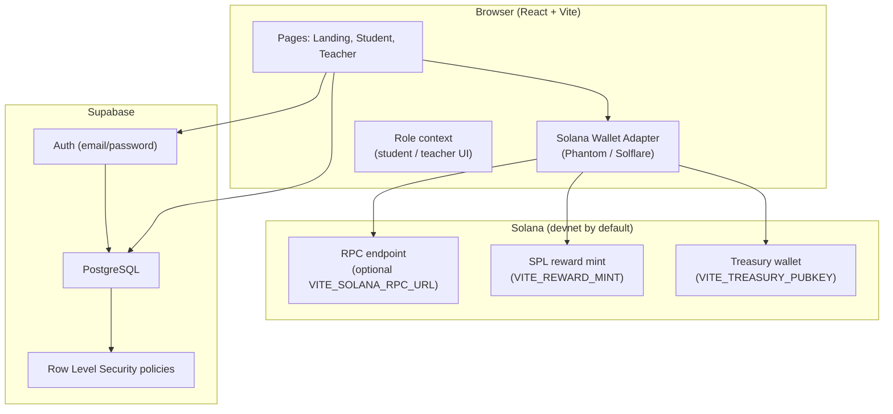
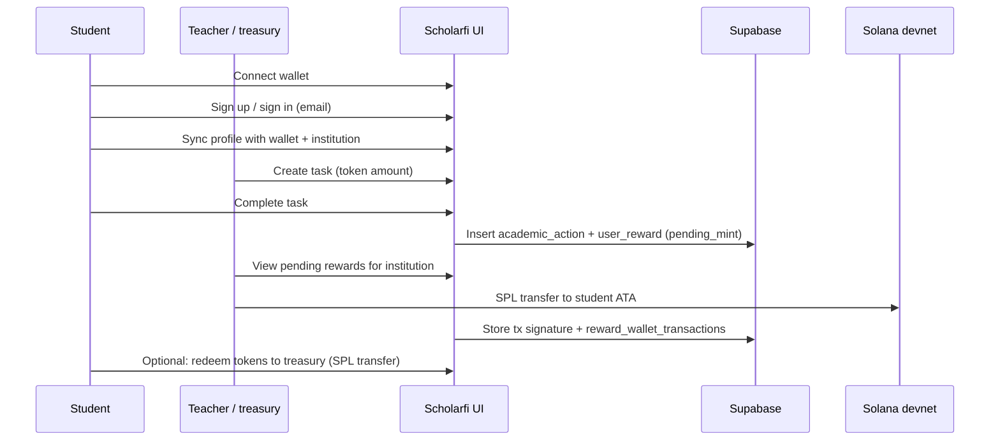

# Scholarfi

**Turn academic effort into real on-chain rewards.**

Scholarfi is a web app that links **verifiable school activity** (assignments, milestones, and related events) to **SPL token rewards on Solana**. Students earn tokens they can hold or redeem; teachers and institutions define tasks and settle rewards on-chain, while Supabase stores profiles, academic actions, and reward state with row-level security.

---

## Vision & social impact

**The idea:** Many learners invest real time and discipline with little transparent, portable recognition beyond grades. Scholarfi experiments with **wallet-based identity**, **institution-scoped tasks**, and **tokenized rewards** so effort can be recorded consistently, settled on a public ledger, and eventually connected to **real-world benefits** (partners, perks, redemptions)—closing the loop from “I did the work” to “something I can use or show.”

**Social impact (intended direction):**

- **Recognition & motivation** — Makes effort visible and transferable, which can help students who are underserved by traditional credentialing alone.
- **Financial literacy & access** — Introduces self-custody and token concepts in a structured, school-aligned context (currently oriented toward **devnet** for safe experimentation).
- **Transparency** — On-chain transfers and database records support clearer audit trails than ad-hoc spreadsheets or closed loyalty points.
- **Open building blocks** — Institutions, partners, and future integrations can plug into a shared model: **academic actions → rewards → redemption / benefits** (schema includes partners and benefits for that path).

---

## Architecture (high level)



**Responsibilities:**

| Layer | Role |
|--------|------|
| **React app** | Routes, dashboards, wallet connect, SPL transactions (send reward, redeem, delegate flows). |
| **Supabase** | User accounts, `profiles` (wallet + institution), `tasks`, `academic_actions`, `user_rewards`, `reward_wallet_transactions`, plus institutions/partners/benefits for future redemption catalogs. |
| **Solana** | SPL token balances and transfers; configured mint and treasury for rewards and redemptions. |

---

## Current workflow



**Student path (simplified):**

1. Connect a Solana wallet and authenticate with Supabase (email/password in the current UI).
2. Sync the profile so the **wallet address** and **institution** align with RLS and task eligibility.
3. **Complete tasks** published for that institution → creates a **verified** academic action and a **pending** token reward row.
4. After the teacher (or treasury) **sends SPL tokens on-chain**, the app records the transaction and updated reward status.
5. **Redeem** (optional): send tokens back to the configured treasury as the on-chain side of a redemption loop (future partner benefits can build on the same schema).

**Teacher path (simplified):**

1. Same wallet + Supabase session; institution-scoped **task** creation.
2. Monitor **pending token rewards** for learners in the same institution.
3. Use the **treasury-connected wallet** to fulfill transfers; optional **delegate** flows exist for advanced treasury operations.

---

## Tech stack

- **Frontend:** React 19, TypeScript, Vite 8, Tailwind CSS 4, DaisyUI  
- **Routing:** React Router  
- **Chain:** `@solana/web3.js`, `@solana/spl-token`, Solana wallet adapter (Phantom, Solflare)  
- **Backend / data:** Supabase JS client, PostgreSQL schema under `supabase/migrations/`

---

## Local development

**Prerequisites:** Node.js, npm, a Supabase project with migrations applied, and Solana **devnet** configuration for testing.

1. Clone the repository and install dependencies:

   ```bash
   npm install
   ```

2. Copy environment variables and fill in values from your Supabase project and Solana setup:

   ```bash
   cp .env.example .env
   ```

   Key variables (see `.env.example` for the full list):

   - `VITE_SUPABASE_URL`, `VITE_SUPABASE_ANON_KEY`
   - `VITE_REWARD_MINT` — SPL token mint on the target cluster
   - `VITE_TREASURY_PUBKEY` — must match the wallet you use for teacher-side sends in the UI
   - Optional: `VITE_SOLANA_RPC_URL`, `VITE_REWARD_TOKEN_SYMBOL`, `VITE_DEFAULT_INSTITUTION_ID`

3. Run the dev server:

   ```bash
   npm run dev
   ```

4. Production build:

   ```bash
   npm run build
   ```

---

## Repository layout (overview)

| Path | Contents |
|------|-----------|
| `src/pages/` | `LandingPage`, `StudentDashboard`, `TeacherDashboard` |
| `src/lib/` | Supabase data access (`db.ts`), SPL helpers (`splReward.ts`), signing helpers |
| `src/providers/` | Solana wallet + connection provider |
| `src/context/` | Student/teacher role context for the UI |
| `supabase/migrations/` | SQL migrations for schema and auth/profile behavior |

---

## License & status

This repository is **private** (`package.json`). The product is under active development; **use devnet** and test keys for experiments unless you explicitly configure otherwise.
