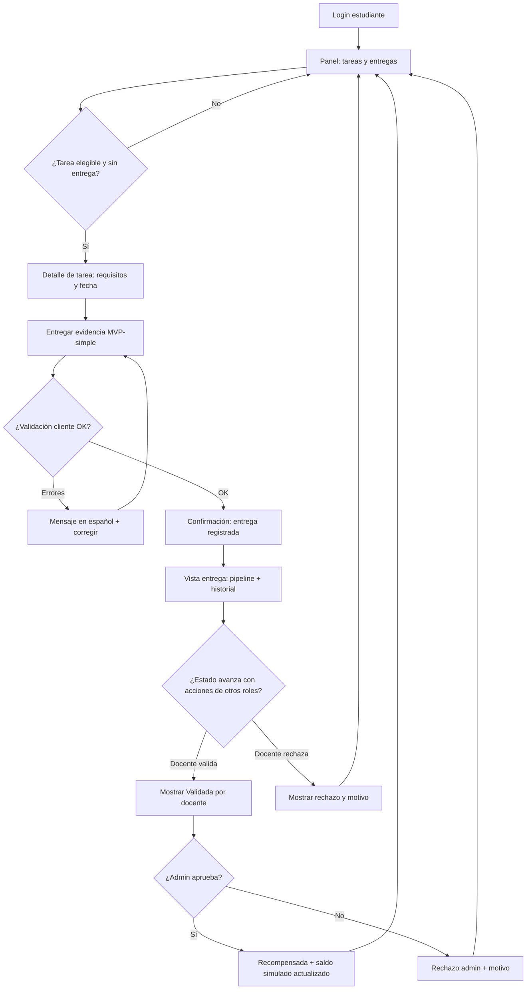
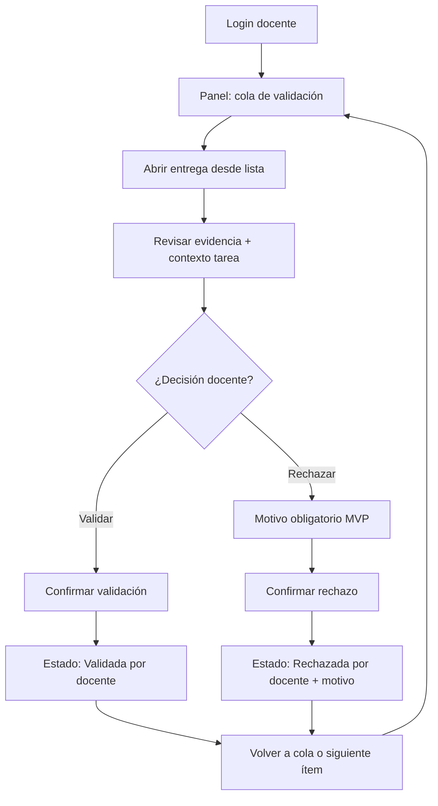
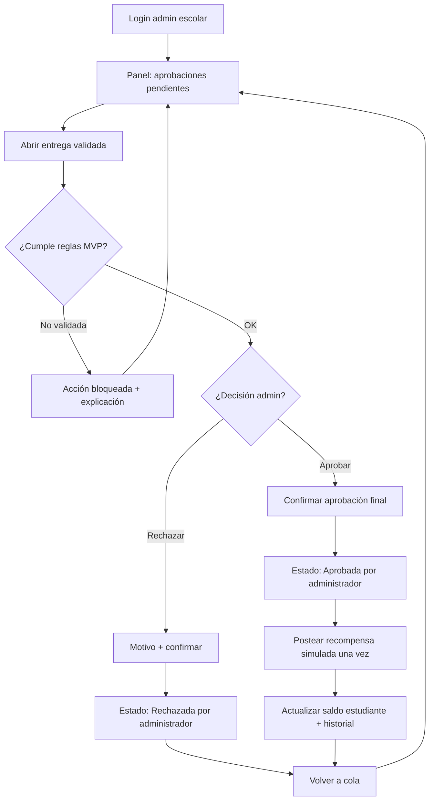
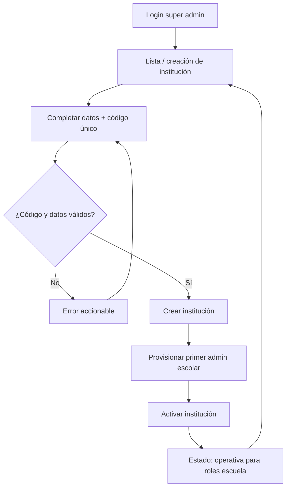
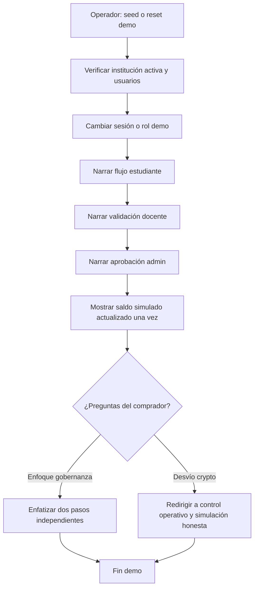

---
stepsCompleted:
  - 1
  - 2
  - 3
  - 4
  - 5
  - 6
  - 7
  - 8
  - 9
  - 10
  - 11
  - 12
  - 13
  - 14
lastStep: 14
uxDesignCompletedAt: "2026-04-28"
inputDocuments:
  - /Users/angelserrano/development/scholarfi/_bmad-output/planning-artifacts/prd.md
  - /Users/angelserrano/development/scholarfi-back/_bmad-output/planning-artifacts/product-brief-scholarfi.md
  - /Users/angelserrano/development/scholarfi-back/_bmad-output/planning-artifacts/product-brief-scholarfi-distillate.md
  - /Users/angelserrano/development/scholarfi-back/temp.md
  - /Users/angelserrano/development/scholarfi/notes/design-notes.md
visualReferences:
  - /Users/angelserrano/development/scholarfi/notes/screen.png
  - /Users/angelserrano/development/scholarfi/notes/image.png
workflowType: ux-design
---

# UX Design Specification scholarfi

**Author:** Angel
**Date:** 2026-04-28

---

<!-- UX design content will be appended sequentially through collaborative workflow steps -->

## Executive Summary

### Project Vision

ScholarFi Demo Simulator is a LatAm-facing, Spanish-labeled product experience that makes institutional reward governance tangible in minutes: users can see a submission move through a controlled pipeline and watch simulated value post only after explicit teacher and school-admin approvals—without blockchain setup.

### Target Users

- Super Admin: activates institutions and establishes the first school operator.
- School Admin: provisions users, maintains final reward authority, and reviews approval queues.
- Teacher: creates academic tasks and validates evidence quickly.
- Student: completes tasks with clear expectations and transparent status progression.
- Internal sales engineer: runs repeatable demos with minimal friction and predictable queues.

### Key Design Challenges

- Convey institutional trust and finality without relying on wallet/blockchain metaphors in core school workflows.
- Make role-specific navigation and next actions obvious for fast live demos.
- Keep Spanish status language consistent, readable, and aligned to a strict workflow state machine.
- Deliver a premium “Intellectual Ledger” aesthetic without introducing unnecessary UI complexity for MVP.

### Design Opportunities

- A cross-role “pipeline ledger” visualization that becomes ScholarFi’s signature comprehension surface.
- Editorial, asymmetric layouts that signal seriousness (school leadership buyers) while staying fast to scan (teachers).
- Tonal surface hierarchy and accent motifs that communicate verification/trust states without noisy borders or gamified clutter.

## 2. Core User Experience

### 2.1 Defining Experience

ScholarFi’s defining interaction is **institutional pipeline comprehension**: a submission is always understandable as an object moving through **governance states**, with the UI making the **next human action** obvious for each role.

**The core loop users should be able to describe in one breath**

**Entregar evidencia → ver progreso claro en español → ver aprobaciones explícitas → recibir recompensa simulada solo al final**

If we nail **pipeline legibility + next-action clarity across roles**, the product feels legitimate in a school context and the demo narrative stays coherent—even before feature breadth expands.

**Platform & interaction context (supporting)**

- **Primary surface:** responsive **web**, **desktop-first** for sales demos and operator workflows (school admin/teacher).
- **Input model:** mouse/keyboard first; touch targets remain comfortably tappable.
- **Offline:** not required for MVP.
- **Accessibility:** keyboard-first traversal on the PRD “core flows,” with visible focus and readable contrast on badges and status rails.

### 2.2 User Mental Model

**What users are trying to accomplish**

- **Students** think: “I did the work—did the school *accept* it, and what happens next?”
- **Teachers** think: “What needs my judgment right now, and what am I certifying?”
- **School admins** think: “What is pending my final authority, and what did we just fund?”
- **Buyers/internal demo runners** think: “Can I trust this as an operational control story in under two minutes?”

**Mental model we want to reinforce**

- This is a **controlled institutional ledger**, not a consumer rewards app and not a crypto wallet flow.
- Value movement is **explicitly gated**: progression is visible, but “money-like” outcomes happen only after **teacher validation + admin approval**.

**Where confusion/friction typically appears (and how we design against it)**

- **Opaque statuses** → we standardize Spanish labels and show the pipeline in-place (not only in a separate screen).
- **Ambiguous authority** → we separate **validación docente** vs **aprobación administrativa** in copy, badges, and audit trails.
- **“Crypto smell”** → no wallet/on-chain metaphors in student flows; simulated economy is labeled plainly.

### 2.3 Success Criteria

**What “this just works” feels like**

- A new user can answer: **“¿En qué estado está esto y quién debe actuar?”** within a few seconds of opening the relevant screen.
- Role dashboards always present a **primary queue** (counts + next item), not a dead-end landing.
- Approvals feel **fast and legible**: minimal fields, strong defaults, obvious confirm semantics.

**Success indicators**

- **Pipeline fidelity:** students can trace the same state names across student, teacher, and admin views.
- **Operator speed:** teacher validation and admin approval are each completable as a **single focused task** (MVP evidence stays lightweight).
- **Finality clarity:** when a reward posts, the UI communicates **one clear causal chain** from approvals to balance update—without implying real money movement.

**Quantitative/demo targets (from PRD intent)**

- Keep core demo flows within the **~2 minute** storytelling window by prioritizing queues, shortcuts, and seeded happy paths.

### 2.4 Novel UX Patterns

ScholarFi’s core experience is mostly **established patterns composed in a disciplined way**:

- **Established:** queue-first review screens, detail pages with metadata rails, status badges, audit/history panels, dashboard “hero + next steps” composition (aligned to the reference mocks’ strengths).
- **Novel (market positioning, not a new interaction physics):** a cross-role **pipeline ledger** metaphor—consistent governance language and chronology that makes **two-step approval** feel as concrete as a transaction finality story, without blockchain cues.
- **Education strategy:** we do not teach a new gesture; we teach **meaning** (what each state implies, who holds authority, and why the student should trust the outcome).

### 2.5 Experience Mechanics

**1) Initiation**

- **Student:** starts from an assigned task (“Entregar evidencia”) with explicit expectations and due context.
- **Teacher:** lands on a **validation queue** surfaced as the primary CTA (“Validar entregas”).
- **School admin:** lands on an **approval queue** (“Aprobaciones pendientes”) with final-authority framing.
- **Super admin / internal operator:** starts from institution activation and user provisioning flows when running seeded demos.

**2) Interaction**

- **Student submits** evidence through a short, guided flow optimized to reduce uncertainty (what to upload/enter for MVP).
- **Teacher validates** using a review layout that pairs evidence + rubric/checklist (MVP-simple) + a decisive primary action.
- **Admin approves** with an explicit confirmation that communicates institutional finality.
- The system records **state transitions** and surfaces **history** as a readable timeline (audit comprehension).

**3) Feedback**

- **State-driven feedback:** each transition updates badges, the pipeline visualization, and (where appropriate) queue counts.
- **Human clarity over animation:** subtle tonal success states; avoid noisy gamification.
- **Errors:** permission and invalid-transition errors name **the blocking role** and **the next step** in Spanish.

**4) Completion**

- **Student completion:** the submission reaches **Recompensa** (simulated) with an understandable “why now” explanation tied to approvals.
- **Operator completion:** queues empty (or clearly deprioritized), with an auditable record of actions taken.
- **What’s next:** return users to the next queue item or to a dashboard that shows updated balances and upcoming milestones.

### Experience Principles (carried forward from core experience discovery)

- **Ledger clarity over crypto cues:** governance and progression first; no wallet language in core school flows.
- **Quiet authority:** generous space, tonal surfaces, restrained color drama; status uses disciplined badge semantics.
- **Asymmetric focus:** primary work column + contextual metadata column (inspired by the dashboard mock, adapted per role).
- **Deterministic demos:** predictable queues and seeded paths beat breadth.

## Desired Emotional Response

### Primary Emotional Goals

- **Institutional trust:** the product should feel serious, legible, and under control—like an operational system schools can adopt, not an experimental crypto toy.
- **Calm confidence:** users should feel they always know where they are in the process and what happens next (especially in Spanish).
- **Focused efficiency for operators:** teachers and admins should feel they can move work forward quickly without hunting.
- **Fair clarity for students:** students should feel the pathway is understandable and legitimate—merit is earned and verified, not mysterious.

### Emotional Journey Mapping

- **First impression (login + role entry):** premium, composed, institutional, with subtle innovation cues—not hype.
- **During core workflows (queues + approvals):** clarity + momentum; stress stays low because the UI surfaces next actions and state meaning.
- **After success (reward posted):** satisfaction + legitimacy; the user should feel this outcome makes sense given the steps.
- **When blocked (permissions / invalid state):** safe frustration—clear explanation and guidance, never shamey or cryptic errors.

### Micro-Emotions

- **Confidence vs confusion:** prioritize explicit pipeline language and consistent Spanish terms.
- **Trust vs skepticism:** emphasize governance (two-step approvals) with clean audit visibility; avoid crypto fear triggers in student flows.
- **Accomplishment vs anxiety:** celebrate completion with restrained success states (tonal lift + precise copy), not loud gamification.

### Design Implications

- **Trust:** editorial layout, tonal surfaces, disciplined typography, minimal neon, strong hierarchy.
- **Clarity:** persistent pipeline component; consistent badge semantics; next step modules on dashboards.
- **Efficiency:** queue-first IA for teacher/admin; primary actions always visible; short forms.
- **Student appropriateness:** plain-language Spanish; simulated economy labeled honestly (“Recompensa simulada”, “Saldo simulado”).

### Emotional Design Principles

- **Quiet authority beats loud novelty.**
- **Transparency beats mystery** (status always visible).
- **Governance is the product** (make approvals feel intentional, not bureaucratic).
- **Demo-grade resilience:** emotional experience stays steady even when something fails (helpful errors).

## UX Pattern Analysis & Inspiration

### Inspiring Products Analysis

**ScholarFi reference mocks (local): `notes/screen.png`, `notes/image.png`**

- **What they do well:** a **split hero** auth layout that signals brand gravity; a **dashboard** that combines a **hero metric**, **milestone module**, **filterable work list**, and a **right-rail context panel**—strong for ledger-like comprehension.
- **MVP adaptation:** keep the **composition patterns** (split auth, asymmetric dashboard, right-rail metadata), but **remove wallet/Stellar/Web3 affordances** from copy and primary actions; replace with **“simulado / institucional”** framing.

**Linear (issue workflow UX)** *(pattern reference, not feature parity)*

- **What it does well:** fast queue workflows, crisp statuses, keyboard-friendly density without feeling messy.
- **Lesson for ScholarFi:** teacher/admin flows should feel **queue-first** with **obvious state** and a **single primary action**.

**Notion / modern productivity suites (editorial spacing + hierarchy)** *(pattern reference)*

- **What they do well:** calm hierarchy, generous spacing, strong sectioning without harsh dividers.
- **Lesson for ScholarFi:** supports the **Quiet Authority / Intellectual Ledger** emotional goal.

### Transferable UX Patterns

- **Split-screen authentication:** brand narrative left, focused task right (from `image.png`).
- **Asymmetric dashboard:** wide primary workspace + narrow contextual rail (from `screen.png`).
- **Hero metric + milestone header cluster:** use for **Saldo simulado / Próximo hito** on student; **Aprobaciones pendientes / Validaciones** on admin/teacher.
- **Status pills + accent tab cards:** communicate verification/trust without crypto jargon (aligns with design notes).
- **Right-rail timeline/chronology:** map to **Historial de acciones** for a submission (audit comprehension).

### Anti-Patterns to Avoid

- **Wallet-first or chain-first onboarding** in a school demo (creates skepticism and derails the governance story).
- **Neon “DeFi alert” styling** for ordinary school tasks (undermines institutional trust).
- **Dense admin tables without next-action scaffolding** (breaks the <2 minute demo).
- **Inconsistent Spanish status labels** across screens (destroys pipeline clarity).

### Design Inspiration Strategy

- **Adopt:** split auth structure; asymmetric dashboard; strong typographic hierarchy; badge semantics; right-rail context; tonal surfaces (per design notes).
- **Adapt:** “MERIT/Yield” language becomes **Recompensa simulada / Progreso**; milestone modules become **deadline + estado**; remove external chain branding.
- **Avoid:** gimmicky gamification, harsh grid-of-boxes SaaS, and crypto metaphors in student-facing flows.

## Design System Foundation

### 1.1 Design System Choice

**Tailwind CSS + daisyUI + custom “ScholarFi Intellectual Ledger” theme tokens** (CSS variables + Tailwind theme extension; selective component overrides).

### Rationale for Selection

- **Speed for MVP demos:** daisyUI provides consistent, ready-made components (buttons, forms, modals, navbar, tabs) while staying Tailwind-native.
- **Brand differentiation remains achievable:** daisyUI is theme-driven; we can express the **tonal “paper stack”**, **gradient primary CTAs**, and **glass nav/modals** through tokens plus a small set of custom component classes.
- **Fits React + TypeScript** and matches the goal to **customize on top** rather than hand-building every primitive from scratch.
- **Accessibility:** daisyUI improves baseline consistency, but we still validate keyboard/focus/contrast on PRD “core flows” as acceptance checks.

### Implementation Approach

- **Install/configure:** Tailwind + daisyUI plugin + `theme.extend` mapping to **semantic CSS variables**.
- **Theming strategy:**
  - Define semantic tokens: `surface`, `surface-container-*`, `on-surface`, `primary`, `primary-content`, `secondary`, `accent` (used intentionally—may map to tertiary for “growth” metrics), `neutral`, `error`, etc.
  - Add ScholarFi-specific utilities where defaults conflict with the brand (submerged inputs, “no divider lists”, left accent “trust tab”, ambient shadow spec).
- **Component strategy:**
  - Use daisyUI for structure (`btn`, `card`, `modal`, `navbar`, `tabs`, `badge`, `table` where appropriate).
  - Add a thin wrapper layer (`src/components/sf/*`) so screens don’t scatter repetitive class strings.
- **Typography:** Plus Jakarta Sans via Tailwind `fontFamily`.

### Customization Strategy

- **Override daisyUI’s default SaaS flatness** using tonal backgrounds instead of borders for sectioning (per design philosophy).
- **Glass** only for **top navigation + modals/drawers**; avoid glassifying dense content surfaces.
- **Primary CTA gradient** via a dedicated utility/class compatible with daisyUI buttons.
- **Spanish canonical copy** centralized (e.g., `src/i18n/es.ts`) so statuses remain consistent across roles.
- **MVP guardrails:** remove wallet/blockchain affordances from core school flows; label simulated economy honestly (“Recompensa simulada”, “Saldo simulado”).

## Visual Design Foundation

### Color System

**Brand baseline (from `notes/design-notes.md`)**

- **Primary:** `#00595C` (deep teal — institutional, calm “ledger” authority)
- **Secondary:** `#5C5200` (olive/gold — warmth without neon “yield” energy)
- **Tertiary / accent:** `#2E3192` (deep indigo — used sparingly for emphasis, links, selected pipeline stages, and “verification” accents)
- **Neutral:** `#747877` (cool gray — secondary text, subdued metadata, quiet dividers when unavoidable)

**Semantic mapping strategy (implementation-facing)**

- **Surfaces:** layered “paper stack” backgrounds using **very subtle cool-tinted neutrals** derived from the palette (not flat white everywhere), keeping saturation low to preserve seriousness.
- **Text:**
  - **Primary text:** near-black with a slight cool bias (high contrast on surfaces)
  - **Secondary text:** neutral family for metadata, timestamps, helper copy
  - **Inverse text:** on primary buttons and dark accents
- **Primary actions:** primary teal for the main CTA; maintain a **high-contrast** `primary-content` (typically near-white) and verify hover/active states don’t reduce legibility.
- **Secondary actions:** outline/ghost treatments using neutral borders + neutral text (avoid competing with primary).
- **Status semantics (Spanish UX, consistent badges):**
  - **Pending / waiting:** neutral + subtle surface tint
  - **Teacher-validated:** tertiary accent used as *signal*, not as a background flood
  - **Admin-approved:** primary-teal success framing (badge/border-left motif)
  - **Rewarded (simulated):** restrained “success” treatment (quiet greenish-teal alignment) + explicit copy that it is **simulated**
  - **Blocked / error:** warm-red family *not* in the brand baseline → introduce a dedicated **error** token (separate from secondary gold) to avoid “reward-ish” coloring
- **Focus rings:** high-visibility focus color (often tertiary or a dedicated focus token) to satisfy keyboard-first demos.

**Accessibility compliance approach**

- Validate **WCAG contrast** for: `primary` on buttons, `tertiary` on links, badge text on tinted badge backgrounds, and glass nav text over imagery/blur.
- Avoid using **gold secondary** for small text on light surfaces unless contrast passes; prefer it for **accents**, highlights, and iconography over large areas.

### Typography System

**Typeface**

- **Primary:** Plus Jakarta Sans (UI + reading)

**Tone & hierarchy**

- **Tone:** modern institutional — confident, readable, not playful.
- **Hierarchy strategy:** strong title/body separation; numbers (balances, counts) should read as **tabular/semibold** for ledger-like clarity.

**Type scale (desktop-first, responsive tightening on small widths)**

- **Display / page title:** largest scale, tight letter spacing slightly relaxed (not condensed)
- **H2 section headers:** clear step-down; used for dashboard modules (“Cola de validación”, “Historial”)
- **H3 component headers:** card titles, drawer titles
- **Body:** comfortable line height for Spanish paragraphs (slightly more leading than English defaults)
- **UI labels / table headers:** one step smaller than body, medium weight
- **Badges / metadata:** smallest size still legible; never rely on tiny text for critical state meaning

**Pairing rationale**

- Plus Jakarta Sans supports both **UI density** and **marketing gravitas**, matching split auth + dashboard composition without needing a second font for MVP.

### Spacing & Layout Foundation

**Spacing system**

- **Base unit:** 4px grid, with **8px as the primary rhythm** (8/16/24/32/48) to keep layouts calm but efficient for queue workflows.
- **Component padding:** default **16–24** inside cards; denser **12–16** for table rows and queue lists.
- **Section separation:** prefer **tonal surface changes** + spacing over heavy divider lines (aligns with “Quiet Authority”).

**Layout principles**

- **Asymmetric dashboard:** wide primary workspace + narrow context rail for metadata/history (from reference composition patterns).
- **Queue-first screens:** top region shows counts + primary CTA; list is the main body; detail is a predictable drill-in pattern.
- **Max content width:** constrain ultra-wide layouts so line length stays readable; allow tables/queues to scroll horizontally only as a last resort.

**Grid**

- **12-column grid** for desktop; collapse to single-column stacks on small screens with the context rail becoming a **drawer** or **accordion** section.

### Accessibility Considerations

- **Keyboard-first demos:** visible focus, logical tab order in modals/drawers, and escape/back patterns that don’t trap users.
- **Color independence:** pipeline state must not rely on color alone (text label + iconography + placement in the pipeline component).
- **Motion:** keep transitions subtle; respect reduced-motion preferences for core flows.
- **Touch targets:** maintain adequate hit areas on primary actions even though desktop is primary.

## Design Direction Decision

### Design Directions Explored

Eight directions are captured in `ux-design-directions.html`: (1) Quiet Ledger, (2) Queue Dense, (3) Editorial Split Auth, (4) Indigo Verification, (5) Warm Olive CTA, (6) Teal Monochrome, (7) Glass Nav Premium, (8) Wide History Rail. Each applies the same Spanish pipeline semantics (Pendiente → Validación docente → Aprobación admin → Recompensa simulada) with different hierarchy, density, and accent strategy.

### Chosen Direction

**Primary:** Direction 1 — **Quiet Ledger** (tonal surfaces, restrained borders, asymmetric main + rail).  
**Composed elements:** Direction 3 — **Editorial Split Auth** for authentication; Direction 8 — **Wide History Rail** for submission detail / audit-heavy views; optional Direction 7 — **Glass Nav Premium** for top navigation and modal shells only, pending contrast verification in real environments.

### Design Rationale

Quiet Ledger best matches the emotional target (institutional trust, calm confidence) while keeping queue workflows legible. Split auth supports demo storytelling without wallet cues. Indigo and olive remain **disciplined accents** (validation vs warmth / simulated reward), not full-surface palettes. A wider rail makes governance chronology tangible for buyers and admins.

### Implementation Approach

Implement via **Tailwind + daisyUI + CSS variables** (Step 6): map semantic tokens to the Step 8 color system; use daisyUI primitives for buttons, cards, navbar, modals; add thin `sf-*` wrappers for pipeline badges, rail layout, and split auth. Validate focus order and contrast on **glass** variants before locking them for sales demos.

## User Journey Flows

Flows below extend PRD **User Journeys A–F** with screen-level mechanics, decision points, and recovery. Canonical pipeline states: **Pendiente → Validada por docente → Aprobada por administrador → Recompensada** (simulado).

### Estudiante — De la tarea a la recompensa simulada (Journey E)

**Goal:** Entregar evidencia, seguir el pipeline en español, y ver el saldo simulado solo tras la aprobación final.  
**Entry:** Login → panel estudiante (próximas tareas / entregas).  
**Success:** Estado **Recompensada** + saldo actualizado + historial coherente con docente/admin.  
**Friction guards:** un intento de entrega por tarea (MVP); reintentos bloqueados con mensaje claro; sin lenguaje de wallet.

### Docente — Cola de validación (Journey D)

**Goal:** Procesar entregas pendientes; validar o rechazar con motivo; dejar claro que la validación **no** es el cierre financiero.  
**Entry:** Login → panel docente con **conteo de cola** y CTA principal.  
**Success:** Ítem sale de cola o queda en rechazo con estudiante informado; ítems validados aparecen en cola admin.

### Administrador escolar — Aprobación final y salida a ledger simulado (Journey C)

**Goal:** Aprobar solo entregas **ya validadas**; disparar una única actualización de recompensa simulada coherente con auditoría.  
**Entry:** Login → cola de aprobaciones con conteo.  
**Success:** Aprobación → estado final + transacción de recompensa no duplicada + estudiante ve saldo/historial alineado.

### Super administrador — Activar institución piloto (Journey B)

**Goal:** Crear institución con identificador único, provisionar primer admin escolar, activar el tenant para operaciones.  
**Entry:** Login super admin → flujo de instituciones.  
**Recovery:** código duplicado u otros conflictos → error accionable en español.

### Operador interno — Demo de dos minutos (Journey A)

**Goal:** Sembrar o restablecer datos, cambiar de rol sin fricción, narrar en español el pipeline hasta recompensa **solo** tras admin.  
**Entry:** Herramientas internas seed/reset + selector de rol (o cuentas demo).  
**Recovery:** acciones fuera de alcance → error con **quién debe actuar** y siguiente paso.

### Comprador / director — Observación (Journey F)

No es un flujo de sistema separado: observa **Journeys C y D** en vivo. UX debe hacer **visibles** rol, autoridad y separación docente/admin (badges, historial en rail ancho, sin metáforas de wallet en el núcleo escolar).

### Journey Patterns

- **Queue-first landing:** cada rol operativo llega a un **conteo + CTA** alineado a su cola (docente validación, admin aprobación).
- **Drill-in consistente:** lista → detalle con **pipeline + rail de historial**; mismos nombres de estado en todas las vistas.
- **Confirmación explícita en transiciones irreversibles** (validar, aprobar, rechazar) con copy breve en español.
- **Bloqueos educativos:** cuando una transición no es válida, el mensaje nombra **estado actual**, **rol bloqueante** y **siguiente acción**.
- **Demo resilience:** errores de permiso o tenant cerrado guían al operador sin romper la narrativa.

### Flow Optimization Principles

- **Menos pasos hasta el primer “wow”:** estudiante ve pipeline y admin ve cola en el primer minuto del demo.
- **Carga cognitiva por pantalla:** una decisión principal por vista en flujos de aprobación.
- **Retroalimentación continua:** badges, pipeline y conteos de cola se actualizan de forma predecible tras cada acción.
- **Delicia contenida:** éxito mediante elevación tonal y claridad de cierre, no gamificación ruidosa.
- **Recuperación explícita:** rechazos siempre con **motivo** visible al estudiante cuando aplique; reintentos de entrega solo donde el PRD lo permita.

## Component Strategy

### Design System Components

**From Tailwind + daisyUI (foundation)**

- **Actions:** `btn` (+ variants), `dropdown`, `modal` / `dialog`, `swap` (optional for compact toggles).
- **Structure:** `navbar`, `card`, `divider`, `drawer` (mobile rail), `tabs`, `collapse` (accordion for small screens).
- **Forms:** `input`, `textarea`, `select`, `checkbox`, `toggle`, field layout via utilities; validation messaging via `alert` or inline text patterns.
- **Data display:** `table`, `badge`, `stats` (if used sparingly for hero metrics), `tooltip` / `kbd` for demo operator hints.
- **Feedback:** `alert`, `toast` (if adopted), `loading` / `progress` for async submits and approvals.

**Coverage vs. product needs**

- Sufficient for **atomic UI** and most **molecule** patterns (form sections, list rows, modals).
- **Not sufficient alone** for the signature **pipeline + governance** compositions and **role-specific shells**—those are custom `sf-*` components built *on top* of daisyUI + tokens.

### Custom Components

#### SfPipeline

**Purpose:** Mostrar el estado de una entrega como secuencia gobernada (etiquetas canónicas en español), sin depender solo del color.  
**Usage:** Detalle de entrega (estudiante, docente, admin), y resumen en tarjetas de cola.  
**Anatomy:** Fila o columna de pasos; cada paso = etiqueta + estado (completo / actual / pendiente / rechazado); opcional conector sutil.  
**States:** `pending`, `current`, `complete`, `rejected`, `blocked` (no alcanzable aún).  
**Variants:** compacta (lista horizontal de pills ordenadas) vs. vertical (timeline liviana).  
**Accessibility:** `aria-label` con lectura de estado completo; no usar solo color (icono o texto “Actual”).  
**Content guidelines:** Mismos strings que `src/i18n/es.ts`; rechazo muestra **rol** y **motivo** cuando aplique.  
**Interaction:** Solo lectura; tocar un paso puede hacer scroll al detalle relacionado (opcional).

#### SfAuditTimeline (History rail)

**Purpose:** Historial legible de transiciones y decisiones (MVP-light) en el rail derecho.  
**Usage:** Vista detalle de entrega; opcional colapsado en móvil.  
**Anatomy:** Encabezado “Historial” + lista cronológica + entrada con timestamp, actor implícito o explícito, y verbo de acción.  
**States:** vacío (“Sin eventos aún”), carga, error de fetch.  
**Variants:** ancho estándar vs. **wide rail** (Direction 8) para demos con comprador.  
**Accessibility:** lista semántica o region landmark; foco no queda atrapado al tabular.  
**Content guidelines:** español consistente; evitar jerga técnica interna en mensajes de estudiante.  
**Interaction:** expandir entrada larga (collapse) si el texto crece.

#### SfQueuePageShell

**Purpose:** Plantilla consistente para colas operativas (docente / admin): métrica o conteo, CTA primario, lista, slot de filtros MVP.  
**Usage:** Landings de Journey D y C.  
**Anatomy:** Top summary + primary action + `table`/`card` list + paginación MVP si aplica.  
**States:** vacío con guía (“No hay entregas pendientes”), carga, error.  
**Variants:** **dense** (Direction 2) vs. airy default (Direction 1) vía clases de spacing.  
**Accessibility:** encabezado de página único; CTA accesible por teclado antes de la lista cuando tenga sentido.  
**Content guidelines:** CTA verbo en primera persona plural o imperativo claro (“Validar siguiente”).  
**Interaction:** atajo opcional “siguiente en cola” tras confirmar (post-MVP si no cabe).

#### SfSubmissionCard

**Purpose:** Tarjeta de fila en colas con título de tarea, estudiante, tiempo, y mini-pipeline.  
**Usage:** Listas docente/admin; posible reuse en estudiante como “mis entregas”.  
**Anatomy:** Título + meta línea + `SfPipeline` compacta + chevron/hint.  
**States:** hover, selected (si hay selección de fila), disabled si no aplica abrir.  
**Variants:** con/sin miniatura de evidencia (MVP puede omitir).  
**Accessibility:** fila clickeable con `button` o ancla con nombre accesible descriptivo.  
**Content guidelines:** truncar con tooltip solo si no oculta estado crítico.  
**Interaction:** click abre detalle coherente con Journey Patterns.

#### SfSplitAuthLayout

**Purpose:** Auth split-screen (Direction 3): narrativa institucional + formulario enfocado.  
**Usage:** Login / selección de institución si aplica en MVP.  
**Anatomy:** Panel marca (gradiente tonal) + panel formulario blanco.  
**States:** form error inline; loading en submit.  
**Variants:** imagen/gradiente solo en desktop; stack en móvil.  
**Accessibility:** orden de lectura lógico; contraste en panel marca verificado.  
**Content guidelines:** mensaje de marca sin promesas financieras; “simulado” donde toque.  
**Interaction:** submit estándar; foco al primer error.

#### SfGovernanceBlock

**Purpose:** Explicar **por qué** una acción está bloqueada (estado incorrecto, rol incorrecto, institución inactiva).  
**Usage:** Intentos de aprobar sin validación docente; acciones cross-tenant; demo fuera de rol.  
**Anatomy:** Icono + título + cuerpo con **estado actual**, **rol requerido**, **siguiente paso**.  
**States:** warning vs. error; opcional “copiar detalle” para soporte interno.  
**Variants:** inline bajo CTA vs. `alert` global.  
**Accessibility:** `role="alert"` cuando sea resultado de acción reciente.  
**Content guidelines:** siempre accionable; nunca mensaje genérico “403”.  
**Interaction:** enlace opcional “Ir a cola correcta”.

#### SfConfirmActionModal

**Purpose:** Confirmar validación, aprobación o rechazo con resumen corto y riesgo de irreversibilidad percibida.  
**Usage:** Transiciones críticas en flujos D y C.  
**Anatomy:** `modal` daisyUI + resumen + campo motivo si rechazo + botones primario/secundario.  
**States:** submitting, validation error en motivo vacío.  
**Variants:** una o dos acciones destructivas (rechazo) con copy distinto.  
**Accessibility:** foco atrapado en modal, Escape cierra solo si no hay dirty submit; foco restaurado.  
**Content guidelines:** rechazo exige motivo en MVP.  
**Interaction:** confirmar llama API; error vuelve a modal con `SfGovernanceBlock` inline.

#### SfRoleAppShell

**Purpose:** Envoltura de app con `navbar`, contenedor de página, y espacio para rail opcional.  
**Usage:** Todas las rutas autenticadas por rol.  
**Anatomy:** Top nav + main grid opcional de dos columnas.  
**States:** N/A.  
**Variants:** glass nav (Direction 7) como clase opcional del navbar.  
**Accessibility:** skip link a contenido principal (recomendado).  
**Content guidelines:** rol visible en menú o subtítulo discreto para demos.  
**Interaction:** navegación por tabs o links según IA.

### Component Implementation Strategy

- **Token-first:** todo `sf-*` consume variables semánticas (Step 8), no hex sueltos en pantallas.
- **Wrapper delgado:** los `sf-*` componen daisyUI + utilidades Tailwind; evitan copy/paste de class strings en páginas.
- **Copy centralizado:** etiquetas de pipeline y errores desde `src/i18n/es.ts` (o equivalente).
- **Estados alineados al backend:** props de pipeline reflejan el state machine del PRD; UI no inventa transiciones.
- **Pruebas de accesibilidad focalizadas:** modales de confirmación, listas de cola, y pipeline (lectores de pantalla).

### Implementation Roadmap

**Phase 1 — Core (bloquea demos E/D/C)**

- `SfRoleAppShell`, `SfQueuePageShell`, `SfSubmissionCard`, `SfPipeline`, `SfConfirmActionModal`, `SfGovernanceBlock`.

**Phase 2 — Narrativa y confianza**

- `SfSplitAuthLayout`, `SfAuditTimeline`, refinamiento de densidad (variante dense).

**Phase 3 — Operador y pulido**

- Toasts consistentes, empty states ilustrados ligeros, mejoras de teclado en tablas, optional “siguiente en cola”.

## UX Consistency Patterns

### Button Hierarchy

**When to use**

- Cada vista de cola o detalle de aprobación expone **un solo botón primario** alineado al siguiente paso válido (validar, aprobar, entregar).
- Acciones destructivas o difíciles de revertir (**rechazar**) usan botón secundario o variante “outline” y siempre pasan por **`SfConfirmActionModal`**.

**Visual design**

- **Primary:** gradiente/teal token (`btn-primary` tema ScholarFi); texto alto contraste.
- **Secondary:** `btn-ghost` / outline neutro para “Cancelar”, “Volver”, “Guardar borrador” (si aplica).
- **Tertiary:** enlaces de texto para acciones poco frecuentes (“Ver historial completo”).

**Behavior**

- El CTA primario se **deshabilita** durante submit y muestra estado de carga; no permitir doble envío que duplique recompensas.
- Si la acción está bloqueada por estado, el botón primario se reemplaza o deshabilita con **`SfGovernanceBlock`** visible (nunca un click silencioso).

**Accessibility**

- Nombre accesible del botón incluye **objeto + verbo** (“Aprobar entrega de María G.”).
- Focus visible; orden de tab: contenido crítico → primario → secundario.

**Mobile considerations**

- Botones full-width en formularios largos; CTA primario permanece visible al final del viewport o en barra fija solo si no tapa el formulario (preferir flujo corto MVP).

**Variants**

- Modo **dense:** misma jerarquía, menos padding vertical en filas de lista.

### Feedback Patterns

**When to use**

- **Success:** cierre de acción (entrega registrada, validación confirmada, aprobación publicada) — mensaje breve + actualización de pipeline/colas.
- **Warning:** acción posible pero con condición (institución inactiva para algunos roles, tarea casi vencida si el PRD lo define).
- **Error:** fallo de red, validación servidor, transición ilegal — **`SfGovernanceBlock`** o `alert` con recuperación.
- **Info:** contexto de demo o política (“Recompensa simulada”).

**Visual design**

- Preferir **inline contextual** cerca del CTA para errores de acción; `alert` para estado global (sesión, tenant).
- Badges de estado siguen **semántica de color Step 8**; siempre con texto.

**Behavior**

- Toasts (si se adoptan) solo para **confirmaciones no bloqueantes**; transiciones de gobernanza deben reflejarse en **UI persistente** (pipeline + historial).
- No mezclar “éxito” con colores que parezcan “dinero on-chain”; mantener tono institucional.

**Accessibility**

- Errores post-submit anunciados (`role="alert"` o `aria-live="polite"` según severidad).
- No usar solo iconos para tipo de feedback.

**Mobile considerations**

- Alertas largas colapsables; priorizar primera línea con **acción siguiente**.

**Variants**

- Demo operator: opción “copiar detalle técnico” en errores internos (no visible a estudiantes).

### Form Patterns

**When to use**

- Entrega de evidencia (MVP-simple), creación de institución/usuarios, motivo de rechazo (obligatorio).

**Visual design**

- Labels siempre visibles; inputs “submerged” solo si contraste y focus ring pasan auditoría.
- Agrupación por secciones con **espacio tonal**, no muros de borde.

**Behavior**

- Validación **on submit** para MVP salvo campos obvios (email vacío puede onBlur).
- Errores por campo: texto debajo, `aria-describedby` vinculado.
- Motivo de rechazo: textarea con contador suave y mínimo de caracteres si el PRD lo exige.

**Accessibility**

- Primer error enfocado al enviar; orden de campos lógico en lectores de pantalla.

**Mobile considerations**

- Teclados apropiados (`email`, `numeric` si aplica); evitar hover-only hints.

**Variants**

- Formularios de admin con más densidad pero mismas reglas de accesibilidad.

### Navigation Patterns

**When to use**

- **`SfRoleAppShell`:** nav superior con secciones por rol (colas, tareas, usuarios, institución).
- **Drill-in:** lista → detalle con breadcrumb opcional MVP (“Cola / Entrega”).

**Visual design**

- Item activo con subrayado/teal bajo o `tabs` daisyUI para subsecciones del mismo objeto.
- Rail de historial **no** reemplaza la navegación principal; es contexto del detalle.

**Behavior**

- Profundidad máxima preferida: 2 clics hasta acción primaria desde landing de rol.
- Cambio de rol en demo: flujo explícito (logout o selector) para evitar confusiones de permisos.

**Accessibility**

- Landmark `nav`; teclado entre items; estado actual `aria-current`.

**Mobile considerations**

- Rail → `drawer` o acordeón bajo el pipeline; CTA primario permanece en la columna principal.

**Variants**

- Glass nav solo si contraste validado (Step 9).

### Additional Patterns

#### Modal and overlay

**When to use:** confirmaciones de gobernanza (`SfConfirmActionModal`); diálogos cortos.  
**Behavior:** foco atrapado; cierre con Escape según reglas de dirty state; restaurar foco al disparador.  
**Mobile:** modal full-screen estrecho si el contenido + teclado lo requieren.

#### Empty states

**When to use:** cola vacía, sin eventos de auditoría, sin tareas.  
**Visual:** ilustración mínima o icono neutro; copy con **siguiente paso** (“Cuando un estudiante entregue, aparecerá aquí”).  
**Accessibility:** encabezado legible; no depender del icono.

#### Loading states

**When to use:** cargas iniciales de cola y detalle; submits.  
**Visual:** skeletons en listas solo si mejora percepción; spinners en botones para acciones cortas.  
**Behavior:** evitar layout shift brusco; mantener altura de tarjetas estable cuando sea posible.

#### Search and filtering (MVP-light)

**When to use:** listas largas post-MVP; MVP puede limitarse a orden fijo y conteos.  
**Behavior:** si hay búsqueda, debounce + mensaje “sin resultados” accionable (limpiar filtro).

#### Design system integration (custom rules)

- Los patrones **no** sobrescriben el state machine: si el backend rechaza la transición, la UI muestra **governance feedback**, no reintenta automáticamente.
- Cualquier nuevo patrón visual pasa por **tokens semánticos**; prohibido color hardcode fuera del tema.
- Copy visible al usuario en **español canónico**; claves i18n compartidas entre pipeline, badges y errores.

## Responsive Design & Accessibility

### Responsive Strategy

**Desktop (primary — 1024px+)**

- Usar **layout asimétrico**: columna principal ancha + rail de contexto/historial (Step 9 Quiet Ledger + wide rail en detalle).
- Aumentar densidad solo donde los journeys D/C lo beneficien (variante **dense**), sin sacrificar jerarquía de CTA.
- Navegación superior persistente; tablas de cola con scroll horizontal solo como último recurso (preferir wrap de columnas o cards).

**Tablet (768px–1023px)**

- Mantener composición de dos columnas **si cabe**; si no, rail debajo del pipeline en acordeón.
- Objetivos táctiles cómodos en filas de cola; evitar hover-only.

**Mobile (320px–767px)**

- **Mobile-first en implementación** (Tailwind): estilos base para una columna; breakpoints añaden columnas y rail.
- Rail de historial → **`drawer`** o sección colapsable bajo `SfPipeline`; CTA primario permanece en la vista principal.
- Auth split → **apilado**: narrativa arriba o colapsada; formulario debajo (SfSplitAuthLayout).
- Priorizar en pantalla pequeña: **estado del pipeline**, **siguiente acción**, y **cola** (según rol); métricas hero pueden compactarse.

### Breakpoint Strategy

**Breakpoints (Tailwind defaults recomendados)**

- `sm`: 640px — ajustes de padding y tipografía.
- `md`: 768px — activar rail lateral o layout de dos columnas “light”.
- `lg`: 1024px — dashboard asimétrico completo, tablas más amplias.
- `xl`: 1280px — contenido ancho máximo para legibilidad; rail puede ensancharse (Direction 8).

**Enfoque**

- **Desktop-first en diseño de producto** (demo), **mobile-first en CSS** (implementación) para evitar overrides frágiles.

### Accessibility Strategy

**Objetivo**

- **WCAG 2.2 nivel AA** en **flujos núcleo** del PRD: autenticación, entrega estudiante, validación docente, aprobación admin, visualización de saldo simulado.

**Contraste**

- Texto normal **≥ 4.5:1**; grande **≥ 3:1**; UI components y estados **≥ 3:1** donde aplique.
- Revalidar **primary teal**, **tertiary indigo**, **secondary olive** en badges y enlaces sobre superficies tonales y **glass** (Step 8–9).

**Teclado y foco**

- Orden de tab lógico en formularios, colas y **`SfConfirmActionModal`**; foco visible (no `outline: none` sin sustituto).
- **Skip link** “Ir al contenido” en `SfRoleAppShell`.

**Lectores de pantalla**

- Landmarks: `header`, `nav`, `main`, regiones para cola y historial.
- Pipeline: texto + `aria-label` que lea la secuencia completa y el paso actual; estados no solo por color.
- Modales: `aria-modal`, título con `aria-labelledby`, foco inicial y retorno al disparador.

**Touch**

- Objetivo mínimo **44×44px** para controles táctiles en targets compartidos (CTA, filas clickeables).

**Motion**

- Respetar `prefers-reduced-motion` en transiciones de pipeline y modales.

### Testing Strategy

**Responsive**

- Probar en Chrome / Firefox / Safari / Edge en anchos: 360, 768, 1024, 1440.
- Dispositivo real o emulación para: teclado virtual, scroll en tablas, drawer de historial.

**Accesibilidad**

- Automatizado: axe o equivalente en CI en rutas núcleo (cuando existan).
- Manual: recorrido **solo teclado** en validar/aprobar/rechazar y cierre de modal.
- Screen reader spot-check: **VoiceOver** (macOS/iOS) y/o **NVDA** (Windows) en pipeline + cola.
- Simulación de daltonismo en badges y enlaces.

**Usuario**

- Incluir al menos una ronda con **operador de demo** (tiempo al “wow”) y, cuando sea posible, feedback de **docente/admin** sobre legibilidad de estados en español.

### Implementation Guidelines

**Responsive**

- Preferir **rem** y utilidades relativas; evitar anchos fijos para contenedores de texto.
- Imágenes y media con tamaños apropiados; lazy load fuera del above-the-fold crítico del demo.
- Probar **modales + teclado móvil** (viewport resize, barra de direcciones).

**Accesibilidad**

- HTML semántico primero; ARIA solo donde falte (tabs, modal, live regions).
- Formularios: `label` asociado, errores con `aria-describedby`.
- Listas de cola: filas interactivas como `button` o patrón con teclado explícito.
- No usar `div` clickeable sin `role`, foco y `onKeyDown` adecuados.

**Integración daisyUI**

- Verificar que temas personalizados **no eliminen** focus ring; ajustar tokens si el plugin resetea outlines.
- Componentes `table`, `modal`, `tabs`: seguir patrones de foco de la documentación o envolver en `sf-*` con correcciones mínimas.
