# Arquitectura MVP — ScholarFi

Documento de arquitectura inicial para el MVP. Todos los diagramas están en **Mermaid** para que puedas editarlos en GitHub, Notion, Miro (import), VS Code, etc.

**Criterio de aceptación:** arquitectura comprensible, viable y alineada con el alcance del MVP.

> **Alcance MVP:** Las transacciones cripto en **Solana son obligatorias** para el producto final. El modo `TOKEN_MODE=mock` (ledger simulado en DB) existe **solo para piloto y demostración** — permite validar el workflow escolar sin depender de la red en entornos de prueba, pero no sustituye la liquidación on-chain del MVP.

---

## Guía para stakeholders Solana

Diagramas marcados con prioridad para presentaciones a fundaciones, grants, inversores o partners del ecosistema Solana.

| Prioridad | Significado | Uso en pitch |
|-----------|-------------|--------------|
| 🟣 **Alta** | Demuestra uso real de Solana | Mostrar siempre |
| 🟡 **Media** | Contexto técnico o escala | Mostrar si hay tiempo / Q&A |
| ⚪ **Baja** | Interno o educación escolar | Omitir en primera reunión |

### Orden recomendado de presentación (6 slides)

| Slide | Sección | Por qué les importa |
|-------|---------|---------------------|
| 1 | **§1** | Vista general: Solana como capa de liquidación |
| 2 | **§4** | Qué vive on-chain vs off-chain |
| 3 | **§10.7** ⭐ | Historia completa: logro → SPL en wallet |
| 4 | **§10.5 + §10.6** | Prueba técnica: mint, ATA, firmas |
| 5 | **§10.1 o §10.8** | Volumen de txs y escala por aula |
| 6 | **§9** | Solana obligatorio en MVP; mock solo demo |

### Índice de diagramas por prioridad Solana

| Sección | Título | Prioridad |
|---------|--------|-----------|
| §1 | Diagrama simple de arquitectura | 🟣 Alta |
| §2 | Descripción de componentes | 🟡 Media |
| §3.1 | Flujo de recompensa manual | 🟡 Media |
| §3.2 | Flujo por rol (navegación) | ⚪ Baja |
| §4 | Mapa usuario → wallet → Solana → DB | 🟣 Alta |
| §5 | Componentes internos backend | ⚪ Baja |
| §6 | Modelo de datos (ER) | ⚪ Baja |
| §7 | Dependencias e integraciones | 🟡 Media |
| §8 | Riesgos técnicos | 🟡 Media (Q&A) |
| §9 | Decisiones de arquitectura | 🟣 Alta |
| §10.1 | Pipeline Classroom + tokens | 🟣 Alta |
| §10.2 | Classroom sync detallado | 🟡 Media |
| §10.3 | Bucle FIFO | 🟡 Media |
| §10.4 | Orquestación emisión | 🟡 Media |
| §10.5 | Secuencia on-chain (mint SPL) | 🟣 Alta |
| §10.6 | Componentes on-chain | 🟣 Alta |
| §10.7 | End-to-end Classroom → wallet | 🟣 **Alta — slide estrella** |
| §10.8 | Carga de datos / tablas | 🟡 Media |
| §11 | Arquitectura Post-MVP (programs) | 🟣 Alta (roadmap Solana) |

---

## 1. Diagrama simple de arquitectura

> 🟣 **Stakeholder Solana — Prioridad alta** · Slide 1 de 6

Vista de alto nivel de los componentes principales y cómo se conectan.

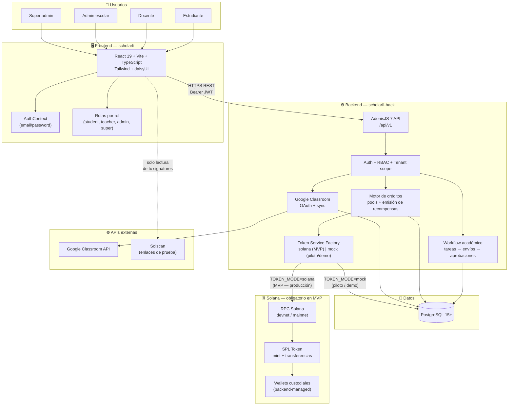
```mermaid
flowchart TB
    subgraph Usuario["👤 Usuarios"]
        Student[Estudiante]
        Teacher[Docente]
        Admin[Admin escolar]
        Super[Super admin]
    end

    subgraph Frontend["🖥️ Frontend — scholarfi"]
        SPA["React 19 + Vite + TypeScript\nTailwind + daisyUI"]
        AuthUI["AuthContext\n(email/password)"]
        Routes["Rutas por rol\n(student, teacher, admin, super)"]
    end

    subgraph Backend["⚙️ Backend — scholarfi-back"]
        API["AdonisJS 7 API\n/api/v1"]
        Auth["Auth + RBAC + Tenant scope"]
        Workflow["Workflow académico\ntareas → envíos → aprobaciones"]
        Credits["Motor de créditos\npools + emisión de recompensas"]
        TokenFactory["Token Service Factory\nsolana (MVP) | mock (piloto/demo)"]
        GCConnector["Google Classroom\nOAuth + sync"]
    end

    subgraph Data["💾 Datos"]
        PG[("PostgreSQL 15+")]
    end

    subgraph Blockchain["⛓️ Solana — obligatorio en MVP"]
        RPC["RPC Solana\ndevnet / mainnet"]
        SPL["SPL Token\nmint + transferencias"]
        Custodial["Wallets custodiales\n(backend-managed)"]
    end

    subgraph External["🌐 APIs externas"]
        GClassroom["Google Classroom API"]
        Solscan["Solscan\n(enlaces de prueba)"]
    end

    Student & Teacher & Admin & Super --> SPA
    SPA --> AuthUI & Routes
    SPA -->|"HTTPS REST\nBearer JWT"| API

    API --> Auth
    Auth --> Workflow & Credits & GCConnector
    Workflow & Credits & GCConnector --> PG
    Credits --> TokenFactory
    TokenFactory -->|"TOKEN_MODE=solana\n(MVP — producción)"| RPC
    TokenFactory -->|"TOKEN_MODE=mock\n(piloto / demo)"| PG
    RPC --> SPL
    SPL --> Custodial

    GCConnector --> GClassroom
    SPA -.->|"solo lectura\nde tx signatures"| Solscan
```

---

## 2. Descripción breve de cada componente

> 🟡 **Stakeholder Solana — Prioridad media** · Referencia, no slide principal

| Componente | Repositorio / tecnología | Responsabilidad |
|------------|--------------------------|-----------------|
| **Frontend (SPA)** | `scholarfi` — React 19, Vite 8, TypeScript | UI por rol, flujos de tareas/envíos/aprobaciones, login email/password, consumo de API REST |
| **Cliente API** | `src/api/client.ts` | `fetch` autenticado, base URL `/api/v1`, manejo de errores en español |
| **Backend API** | `scholarfi-back` — AdonisJS 7, TypeScript | Lógica de negocio, autorización, orquestación del workflow y emisión de recompensas |
| **Base de datos** | PostgreSQL 15+ (Lucid ORM) | Tenancy, usuarios/roles, tareas, envíos, validaciones, pools de crédito, auditoría off-chain e índice de transacciones on-chain |
| **Motor de créditos** | `reward_issuance_service`, pools | Debita presupuesto docente/institución y dispara la emisión de recompensa (idempotente) |
| **Token Service (MVP)** | `solana_token_service` | **Camino de producción:** mint/transfer SPL con wallets custodiales; cada recompensa aprobada genera tx on-chain |
| **Token Service (piloto/demo)** | `mock_token_service` | **Solo demostración:** ledger simulado en DB para validar workflow sin red Solana (`TOKEN_MODE=mock`) |
| **Wallet (MVP)** | Backend custodial | El backend genera y custodia keypairs cifrados por estudiante; firma transacciones server-side (sin wallet en navegador por ahora) |
| **Solana** | `@solana/web3.js`, `@solana/spl-token` | **Red obligatoria del MVP** para liquidar recompensas como tokens SPL (`TOKEN_MODE=solana`) |
| **Google Classroom** | OAuth + sync de calificaciones | Importar tareas, sincronizar notas, distribuir recompensas FIFO hasta agotar presupuesto |
| **Solscan** | Enlace externo en UI admin | Prueba de transacción on-chain (solo lectura, sin firma en cliente) |

---

## 3. Flujo básico del usuario

> 🟡 **Stakeholder Solana — Prioridad media** · §3.1 útil; §3.2 omitir en pitch

### 3.1 Flujo principal de recompensa (happy path)

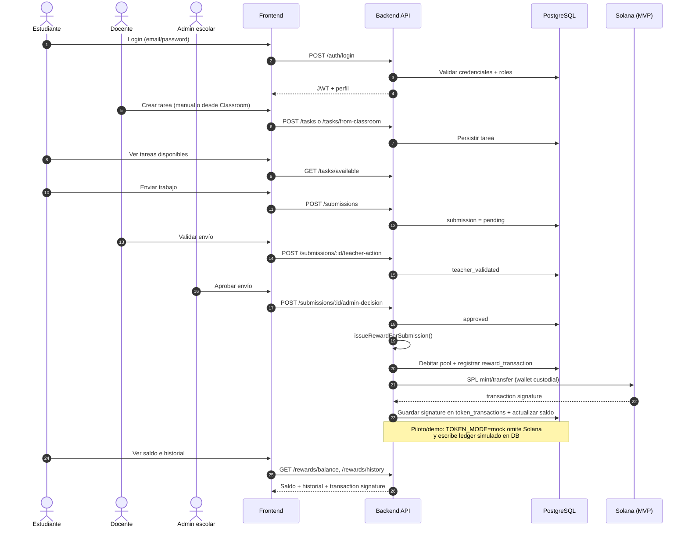
```mermaid
sequenceDiagram
    autonumber
    actor S as Estudiante
    actor T as Docente
    actor A as Admin escolar
    participant FE as Frontend
    participant API as Backend API
    participant DB as PostgreSQL
    participant SOL as Solana (MVP)

    S->>FE: Login (email/password)
    FE->>API: POST /auth/login
    API->>DB: Validar credenciales + roles
    API-->>FE: JWT + perfil

    T->>FE: Crear tarea (manual o desde Classroom)
    FE->>API: POST /tasks o /tasks/from-classroom
    API->>DB: Persistir tarea

    S->>FE: Ver tareas disponibles
    FE->>API: GET /tasks/available
  S->>FE: Enviar trabajo
    FE->>API: POST /submissions
    API->>DB: submission = pending

    T->>FE: Validar envío
    FE->>API: POST /submissions/:id/teacher-action
    API->>DB: teacher_validated

    A->>FE: Aprobar envío
    FE->>API: POST /submissions/:id/admin-decision
    API->>DB: approved
    API->>API: issueRewardForSubmission()
    API->>DB: Debitar pool + registrar reward_transaction

    API->>SOL: SPL mint/transfer (wallet custodial)
    SOL-->>API: transaction signature
    API->>DB: Guardar signature en token_transactions + actualizar saldo

    Note over API,DB: Piloto/demo: TOKEN_MODE=mock omite Solana<br/>y escribe ledger simulado en DB

    S->>FE: Ver saldo e historial
    FE->>API: GET /rewards/balance, /rewards/history
    API-->>FE: Saldo + historial + transaction signature
```

### 3.2 Flujo por rol (navegación)

> ⚪ **Stakeholder Solana — Prioridad baja** · Flujo escolar interno

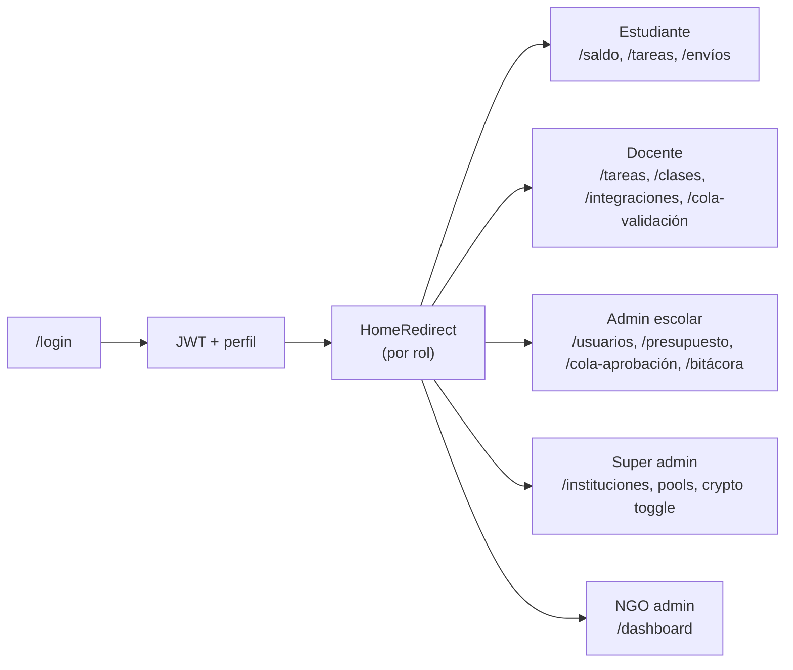
```mermaid
flowchart LR
    Login["/login"] --> Auth["JWT + perfil"]
    Auth --> Redirect["HomeRedirect\n(por rol)"]

    Redirect --> Student["Estudiante\n/saldo, /tareas, /envíos"]
    Redirect --> Teacher["Docente\n/tareas, /clases, /integraciones, /cola-validación"]
    Redirect --> Admin["Admin escolar\n/usuarios, /presupuesto, /cola-aprobación, /bitácora"]
    Redirect --> Super["Super admin\n/instituciones, pools, crypto toggle"]
    Redirect --> NGO["NGO admin\n/dashboard"]
```

---

## 4. Mapa de flujo: Usuario → Wallet → Aplicación → Solana → Base de datos

> 🟣 **Stakeholder Solana — Prioridad alta** · Slide 2 de 6 — límites on-chain / off-chain

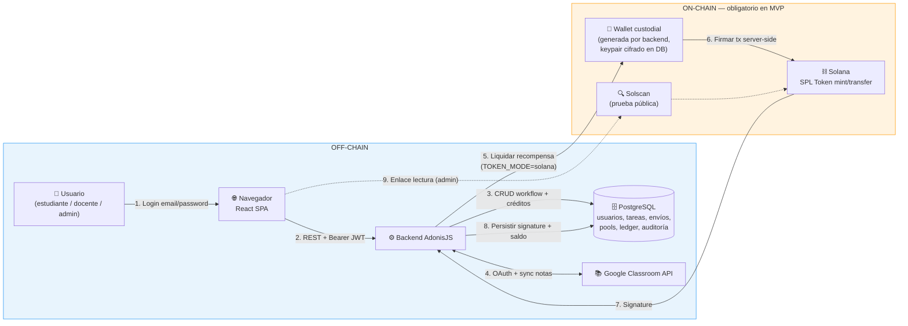
```mermaid
flowchart LR
    subgraph OffChain["OFF-CHAIN"]
        U["👤 Usuario\n(estudiante / docente / admin)"]
        Browser["🌐 Navegador\nReact SPA"]
        API["⚙️ Backend AdonisJS"]
        DB[("🗄️ PostgreSQL\nusuarios, tareas, envíos,\npools, ledger, auditoría")]
        GC["📚 Google Classroom API"]
    end

    subgraph OnChain["ON-CHAIN — obligatorio en MVP"]
        W["🔐 Wallet custodial\n(generada por backend,\nkeypair cifrado en DB)"]
        SOL["⛓️ Solana\nSPL Token mint/transfer"]
        Explorer["🔍 Solscan\n(prueba pública)"]
    end

    U -->|"1. Login email/password"| Browser
    Browser -->|"2. REST + Bearer JWT"| API
    API -->|"3. CRUD workflow + créditos"| DB
    API <-->|"4. OAuth + sync notas"| GC

    API -->|"5. Liquidar recompensa\n(TOKEN_MODE=solana)"| W
    W -->|"6. Firmar tx server-side"| SOL
    SOL -->|"7. Signature"| API
    API -->|"8. Persistir signature + saldo"| DB
    Browser -.->|"9. Enlace lectura (admin)"| Explorer
    Explorer -.-> SOL

    style OffChain fill:#e8f4fd,stroke:#2196F3
    style OnChain fill:#fff3e0,stroke:#FF9800
```

### Leyenda on-chain vs off-chain

| Capa | Qué vive aquí | Ejemplos |
|------|---------------|----------|
| **Off-chain** | Gobernanza, workflow y datos operativos | Login, RBAC, tareas, envíos, aprobaciones docente→admin, pools de crédito, presupuestos, integración Classroom, índice de transacciones |
| **On-chain (MVP obligatorio)** | Liquidación de recompensas como tokens SPL | Mint/transfer SPL, wallets custodiales del estudiante, `transactionSignature` en historial de recompensas |
| **Híbrido** | Backend orquesta; Solana es la capa de liquidación | El backend valida aprobaciones off-chain, debita pool, ejecuta tx on-chain y persiste la prueba en DB |
| **Piloto/demo (`TOKEN_MODE=mock`)** | Simulación off-chain del ledger | Solo para demostraciones y pruebas de workflow sin red; **no cumple el criterio de liquidación cripto del MVP** |

> **Nota MVP:** Toda recompensa aprobada debe terminar en una transacción Solana verificable. El modo mock acelera piloto y demos internas, pero la arquitectura de producción asume `TOKEN_MODE=solana` con `crypto_wallets_enabled` por institución.

---

## 5. Diagrama de componentes internos del backend

> ⚪ **Stakeholder Solana — Prioridad baja** · Due diligence técnica solamente

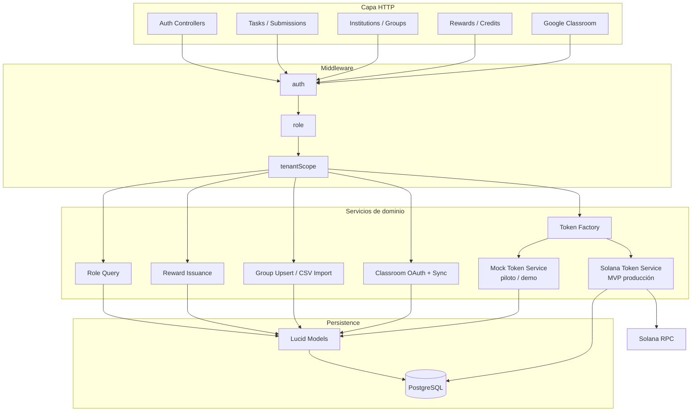
```mermaid
flowchart TB
    subgraph HTTP["Capa HTTP"]
        C1[Auth Controllers]
        C2[Tasks / Submissions]
        C3[Institutions / Groups]
        C4[Rewards / Credits]
        C5[Google Classroom]
    end

    subgraph Middleware
        M1[auth]
        M2[role]
        M3[tenantScope]
    end

    subgraph Services["Servicios de dominio"]
        S1[Role Query]
        S2[Reward Issuance]
        S3[Group Upsert / CSV Import]
        S4[Classroom OAuth + Sync]
        S5[Token Factory]
        S6[Mock Token Service\npiloto / demo]
        S7[Solana Token Service\nMVP producción]
    end

    subgraph Persistence
        Models[Lucid Models]
        PG[("PostgreSQL")]
    end

    C1 & C2 & C3 & C4 & C5 --> M1 --> M2 --> M3
    M3 --> S1 & S2 & S3 & S4 & S5
    S5 --> S6 & S7
    S1 & S2 & S3 & S4 & S6 --> Models --> PG
    S7 --> PG
    S7 --> SolanaRPC["Solana RPC"]
```

---

## 6. Modelo de datos simplificado (entidades clave)

> ⚪ **Stakeholder Solana — Prioridad baja** · Omitir en pitch inicial

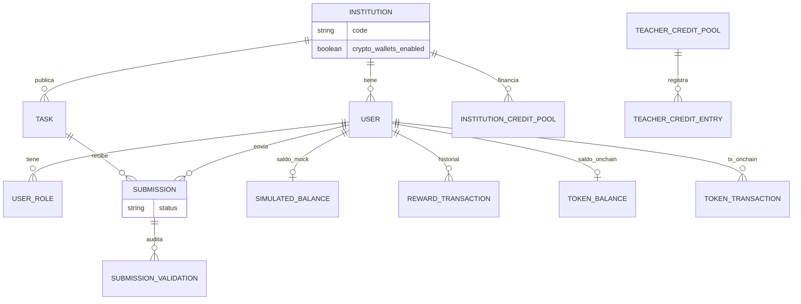
```mermaid
erDiagram
    INSTITUTION ||--o{ USER : tiene
    INSTITUTION ||--o{ TASK : publica
    INSTITUTION ||--o{ INSTITUTION_CREDIT_POOL : financia
    USER ||--o{ USER_ROLE : tiene
    USER ||--o{ SUBMISSION : envia
    TASK ||--o{ SUBMISSION : recibe
    SUBMISSION ||--o{ SUBMISSION_VALIDATION : audita
    TEACHER_CREDIT_POOL ||--o{ TEACHER_CREDIT_ENTRY : registra
    USER ||--o| SIMULATED_BALANCE : saldo_mock
    USER ||--o{ REWARD_TRANSACTION : historial
    USER ||--o| TOKEN_BALANCE : saldo_onchain
    USER ||--o{ TOKEN_TRANSACTION : tx_onchain
    INSTITUTION {
        string code
        boolean crypto_wallets_enabled
    }
    SUBMISSION {
        string status
    }
```

---

## 7. Dependencias técnicas e integraciones críticas

> 🟡 **Stakeholder Solana — Prioridad media** · Destacar fila Solana SPL en §7.2

### 7.1 Stack obligatorio (MVP core)

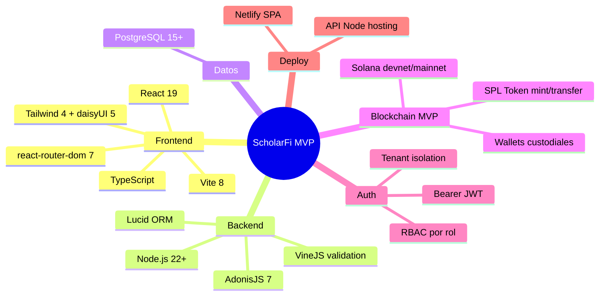
```mermaid
mindmap
  root((ScholarFi MVP))
    Frontend
      React 19
      Vite 8
      TypeScript
      Tailwind 4 + daisyUI 5
      react-router-dom 7
    Backend
      AdonisJS 7
      Lucid ORM
      VineJS validation
      Node.js 22+
    Datos
      PostgreSQL 15+
    Blockchain MVP
      Solana devnet/mainnet
      SPL Token mint/transfer
      Wallets custodiales
    Auth
      Bearer JWT
      RBAC por rol
      Tenant isolation
    Deploy
      Netlify SPA
      API Node hosting
```

### 7.2 Integraciones críticas

| Integración | Criticidad | Modo | Variables / requisitos |
|-------------|------------|------|------------------------|
| **PostgreSQL** | 🔴 Bloqueante | Siempre | `DB_*`, migraciones Lucid |
| **Frontend ↔ Backend REST** | 🔴 Bloqueante | Siempre | `VITE_API_URL`, `CORS_ORIGIN` |
| **Auth JWT** | 🔴 Bloqueante | Siempre | `APP_KEY`, tokens en `auth_access_tokens` |
| **Solana SPL** | 🔴 Bloqueante (MVP) | `TOKEN_MODE=solana` | `SOLANA_RPC_URL`, `SCHOLARFI_TOKEN_MINT`, `MINT_AUTHORITY_SECRET`, `TREASURY_WALLET_PUBLIC_KEY`, `WALLET_ENCRYPTION_KEY` |
| **Solscan (UI)** | 🟡 Alta (prueba on-chain) | MVP | `VITE_SOLANA_CLUSTER`, `VITE_TOKEN_MODE=solana` |
| **Ledger simulado (mock)** | 🟢 Piloto / demo | `TOKEN_MODE=mock` | Sin variables Solana; solo para demostraciones y pruebas de workflow |
| **Google Classroom** | 🟡 Alta (piloto escolar) | Integración piloto | `GOOGLE_CLIENT_ID`, `GOOGLE_CLIENT_SECRET`, `GOOGLE_REDIRECT_URI` |

### 7.3 Dependencias entre módulos

```mermaid
flowchart TD
    A[Auth + RBAC] --> B[Tenant Scope]
    B --> C[Tasks & Submissions]
    C --> D[Two-step Approval]
    D --> E[Credit Pools]
    E --> F[Reward Issuance]
    F --> I[Custodial Wallets + SPL\n(MVP — producción)]
    F -.->|piloto / demo| H[Simulated Ledger\nTOKEN_MODE=mock]
    C --> J[Google Classroom Sync]
    J --> D
```

---

## 8. Principales riesgos técnicos

> 🟡 **Stakeholder Solana — Prioridad media** · Reservar para Q&A (custodia, RPC)

| # | Riesgo | Impacto | Mitigación MVP |
|---|--------|---------|----------------|
| 1 | **Custodia de wallets en backend** | Alto (seguridad, compliance) | Cifrado con `WALLET_ENCRYPTION_KEY`; wallets custodiales obligatorias en MVP; documentar modelo custodial; mock solo en entornos de demo |
| 2 | **Doble emisión de recompensas** | Alto (integridad financiera) | `issueRewardForSubmission()` idempotente; estados de submission estrictos; tests de emisión |
| 3 | **Fugas cross-tenant** | Alto (privacidad) | Middleware `tenantScope` en todas las rutas sensibles; tests de aislamiento por `institution_id` |
| 4 | **Transiciones de estado inválidas** | Medio (workflow corrupto) | Máquina de estados explícita; validación en servicio, no solo en UI |
| 5 | **OAuth Classroom / tokens expirados** | Medio (sync roto) | Refresh tokens cifrados, endpoint de status, modo mock `GOOGLE_CLASSROOM_MOCK` para dev |
| 6 | **RPC Solana inestable o costoso** | Alto (emisión MVP fallida) | Retry + registrar error; health check `GET /token/health`; cola de reintentos; mock **solo** en entornos de piloto/demo, nunca en producción |
| 7 | **Desalineación FE/BE de contratos API** | Medio (bugs de integración) | Envelope `{ data }` consistente; tipos compartidos a futuro (Tuyau/OpenAPI) |
| 8 | **Complejidad de roles (5 tipos)** | Medio (autorización incorrecta) | `RoleGate` en frontend + `role` middleware en backend; matriz de permisos documentada |
| 9 | **Scope creep hacia dApp completa** | Medio (retraso MVP) | MVP exige liquidación Solana custodial; wallet en navegador (Phantom) queda fuera del alcance inicial |
| 10 | **Datos de demo no deterministas** | Bajo (demos inconsistentes) | Comandos `demo:seed` / `demo:reset`; fixtures CSV Classroom |

### Diagrama de riesgos por capa

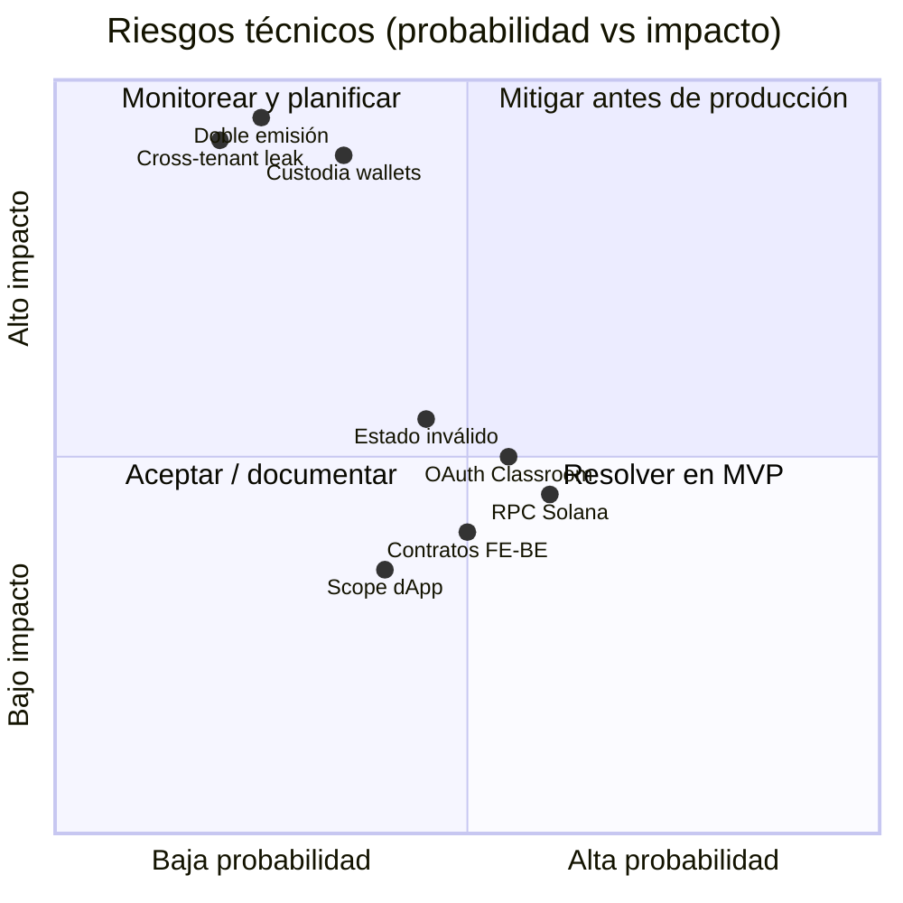
```mermaid
quadrantChart
    title Riesgos técnicos (probabilidad vs impacto)
    x-axis Baja probabilidad --> Alta probabilidad
    y-axis Bajo impacto --> Alto impacto
    quadrant-1 Mitigar antes de producción
    quadrant-2 Monitorear y planificar
    quadrant-3 Aceptar / documentar
    quadrant-4 Resolver en MVP
    Custodia wallets: [0.35, 0.90]
    Doble emisión: [0.25, 0.95]
    Cross-tenant leak: [0.20, 0.92]
    Estado inválido: [0.45, 0.55]
    OAuth Classroom: [0.55, 0.50]
    RPC Solana: [0.60, 0.45]
    Contratos FE-BE: [0.50, 0.40]
    Scope dApp: [0.40, 0.35]
```

---

## 9. Decisiones de arquitectura clave (resumen)

> 🟣 **Stakeholder Solana — Prioridad alta** · Slide 6 de 6 — Solana obligatorio en MVP

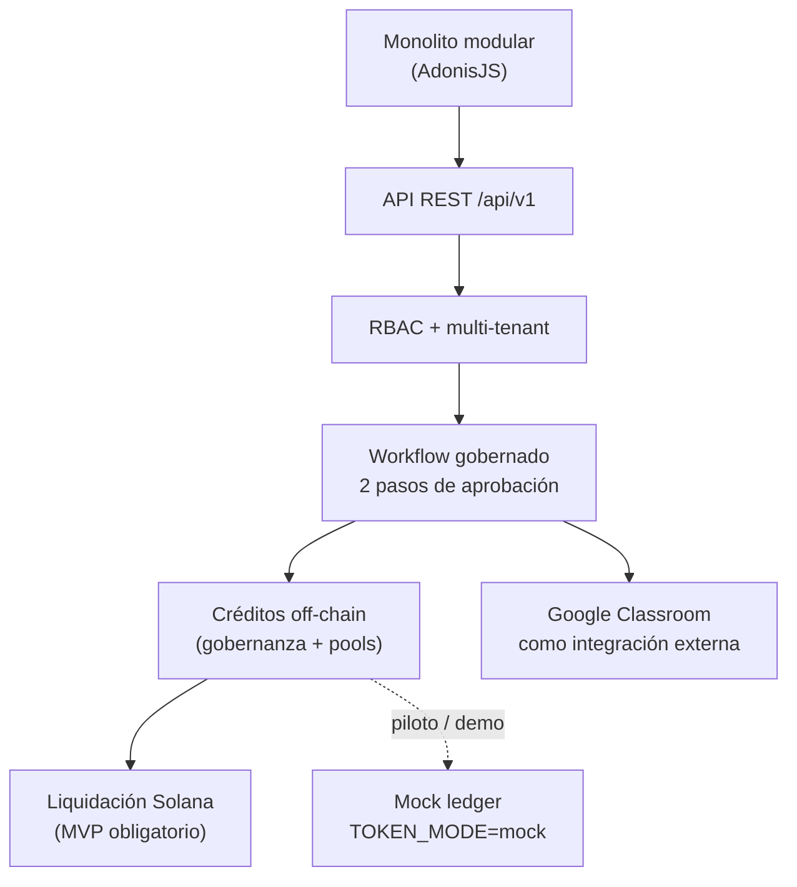
```mermaid
flowchart TD
    D1["Monolito modular\n(AdonisJS)"] --> D2["API REST /api/v1"]
    D2 --> D3["RBAC + multi-tenant"]
    D3 --> D4["Workflow gobernado\n2 pasos de aprobación"]
    D4 --> D5["Créditos off-chain\n(gobernanza + pools)"]
    D5 --> D8["Liquidación Solana\n(MVP obligatorio)"]
    D5 -.->|piloto / demo| D7["Mock ledger\nTOKEN_MODE=mock"]
    D4 --> D9["Google Classroom\ncomo integración externa"]
```

| Decisión | Elección MVP | Alternativa descartada (por ahora) |
|----------|--------------|-------------------------------------|
| Arquitectura | Monolito modular backend + SPA | Microservicios |
| Blockchain | **Solana SPL obligatorio** para liquidar recompensas | Solo ledger simulado como producto final |
| Modo mock | Piloto y demostración (`TOKEN_MODE=mock`) | No reemplaza la tx on-chain del MVP |
| Wallet | Custodial backend (firma server-side) | Wallet en navegador (Phantom) |
| Auth | Email/password + JWT | Wallet-based auth |
| Datos | PostgreSQL relacional (workflow + índice de txs) | Event sourcing / chain como source of truth |

---

## 10. Procesos críticos: Classroom sync + distribución de tokens (detalle)

> 🟣 **Stakeholder Solana — Prioridad alta** · Core del pitch on-chain (§10.5–10.7 son los más relevantes)

Esta sección detalla el **pipeline de mayor carga de procesamiento** del MVP: sincronizar calificaciones desde Google Classroom, evaluar elegibilidad en orden FIFO, debitar presupuesto docente y liquidar tokens en la wallet custodial del estudiante vía Solana.

**Servicios clave:** `sync_service.ts` → `roster_submission_service.ts` → `reward_issuance_service.ts` → `solana_token_service.ts`

### 10.1 Vista general del pipeline (datos pesados)

> 🟣 **Stakeholder Solana — Prioridad alta** · Slide 5 de 6 — escala y volumen de txs

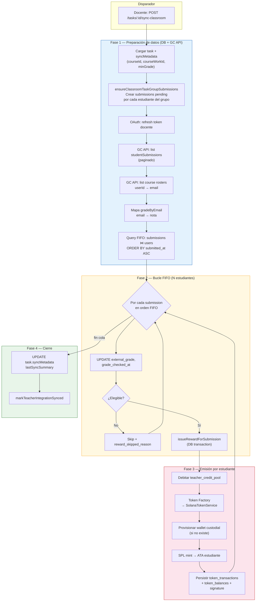
```mermaid
flowchart TB
    subgraph Trigger["Disparador"]
        T1["Docente: POST /tasks/:id/sync-classroom"]
    end

    subgraph Phase1["Fase 1 — Preparación de datos (DB + GC API)"]
        P1A["Cargar task + syncMetadata\n(courseId, courseWorkId, minGrade)"]
        P1B["ensureClassroomTaskGroupSubmissions\nCrear submissions pending\npor cada estudiante del grupo"]
        P1C["OAuth: refresh token docente"]
        P1D["GC API: list studentSubmissions\n(paginado)"]
        P1E["GC API: list course rosters\nuserId → email"]
        P1F["Mapa gradeByEmail\nemail → nota"]
        P1G["Query FIFO: submissions ⋈ users\nORDER BY submitted_at ASC"]
    end

    subgraph Phase2["Fase 2 — Bucle FIFO (N estudiantes)"]
        P2A{"Por cada submission\nen orden FIFO"}
        P2B["UPDATE external_grade,\ngrade_checked_at"]
        P2C{"¿Elegible?"}
        P2D["Skip + reward_skipped_reason"]
        P2E["issueRewardForSubmission\n(DB transaction)"]
    end

    subgraph Phase3["Fase 3 — Emisión por estudiante"]
        P3A["Debitar teacher_credit_pool"]
        P3B["Token Factory\n→ SolanaTokenService"]
        P3C["Provisionar wallet custodial\n(si no existe)"]
        P3D["SPL mint → ATA estudiante"]
        P3E["Persistir token_transactions\n+ token_balances + signature"]
    end

    subgraph Phase4["Fase 4 — Cierre"]
        P4A["UPDATE task.syncMetadata\nlastSyncSummary"]
        P4B["markTeacherIntegrationSynced"]
    end

    T1 --> P1A --> P1B --> P1C --> P1D --> P1E --> P1F --> P1G
    P1G --> P2A --> P2B --> P2C
    P2C -->|No| P2D --> P2A
    P2C -->|Sí| P2E --> P3A --> P3B --> P3C --> P3D --> P3E --> P2A
    P2A -->|fin cola| P4A --> P4B

    style Phase1 fill:#e3f2fd,stroke:#1565C0
    style Phase2 fill:#fff8e1,stroke:#F9A825
    style Phase3 fill:#fce4ec,stroke:#C62828
    style Phase4 fill:#e8f5e9,stroke:#2E7D32
```

### 10.2 Google Classroom sync — flujo detallado

> 🟡 **Stakeholder Solana — Prioridad media** · Detalle de integración; omitir en pitch corto

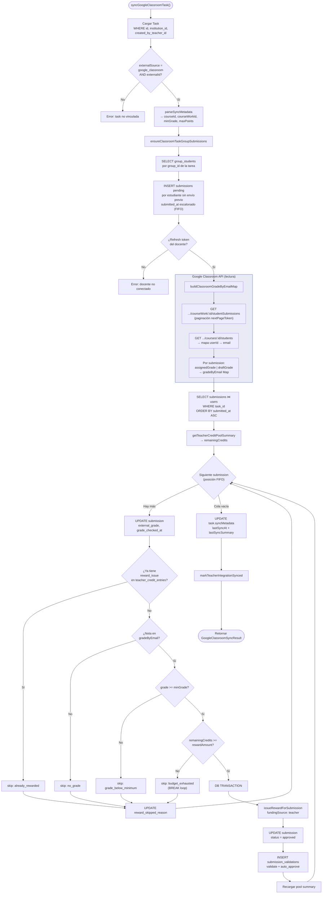
```mermaid
flowchart TD
    Start(["syncGoogleClassroomTask()"]) --> LoadTask["Cargar Task\nWHERE id, institution_id,\ncreated_by_teacher_id"]
    LoadTask --> ValidateGC{"externalSource =\ngoogle_classroom\nAND externalId?"}
    ValidateGC -->|No| Err1["Error: task no vinculada"]
    ValidateGC -->|Sí| ParseMeta["parseSyncMetadata\n→ courseId, courseWorkId,\nminGrade, maxPoints"]

    ParseMeta --> Roster["ensureClassroomTaskGroupSubmissions"]
    Roster --> RosterDetail["SELECT group_students\npor group_id de la tarea"]
    RosterDetail --> RosterInsert["INSERT submissions pending\npor estudiante sin envío previo\nsubmitted_at escalonado (FIFO)"]

    RosterInsert --> OAuth{"¿Refresh token\ndel docente?"}
    OAuth -->|No| Err2["Error: docente no conectado"]
    OAuth -->|Sí| FetchGrades["buildClassroomGradeByEmailMap"]

    subgraph GC_API["Google Classroom API (lectura)"]
        FetchGrades --> ListSubs["GET .../courseWork/:id/studentSubmissions\n(paginación nextPageToken)"]
        ListSubs --> ListRoster["GET .../courses/:id/students\n→ mapa userId → email"]
        ListRoster --> ResolveGrade["Por submission:\nassignedGrade | draftGrade\n→ gradeByEmail Map"]
    end

    ResolveGrade --> LoadQueue["SELECT submissions ⋈ users\nWHERE task_id\nORDER BY submitted_at ASC"]
    LoadQueue --> LoadPool["getTeacherCreditPoolSummary\n→ remainingCredits"]
    LoadPool --> LoopStart{"Siguiente submission\n(posición FIFO)"}

    LoopStart -->|Hay más| UpdateGrade["UPDATE submission\nexternal_grade, grade_checked_at"]
    UpdateGrade --> CheckRewarded{"¿Ya tiene\nreward_issue\nen teacher_credit_entries?"}
    CheckRewarded -->|Sí| Skip1["skip: already_rewarded"]
    CheckRewarded -->|No| CheckGrade{"¿Nota en\ngradeByEmail?"}
    CheckGrade -->|No| Skip2["skip: no_grade"]
    CheckGrade -->|Sí| CheckMin{"grade >= minGrade?"}
    CheckMin -->|No| Skip3["skip: grade_below_minimum"]
    CheckMin -->|Sí| CheckBudget{"remainingCredits >=\nrewardAmount?"}
    CheckBudget -->|No| Skip4["skip: budget_exhausted\n(BREAK loop)"]
    CheckBudget -->|Sí| IssueTx["DB TRANSACTION"]

    IssueTx --> IssueReward["issueRewardForSubmission\nfundingSource: teacher"]
    IssueReward --> ApproveSub["UPDATE submission\nstatus = approved"]
    ApproveSub --> Validations["INSERT submission_validations\nvalidate + auto_approve"]
    Validations --> RefreshPool["Recargar pool summary"]
    RefreshPool --> LoopStart

    Skip1 & Skip2 & Skip3 & Skip4 --> SetSkipReason["UPDATE reward_skipped_reason"] --> LoopStart

    LoopStart -->|Cola vacía| SaveMeta["UPDATE task.syncMetadata\nlastSyncAt + lastSyncSummary"]
    SaveMeta --> MarkSynced["markTeacherIntegrationSynced"]
    MarkSynced --> End(["Retornar GoogleClassroomSyncResult"])

    style GC_API fill:#e8eaf6,stroke:#3949AB
```

**Datos que entran y salen en el sync:**

| Entrada | Origen | Volumen típico |
|---------|--------|----------------|
| Roster del grupo | `group_students` | 1 query × N estudiantes |
| Submissions existentes | `submissions` + `users` | 1 query, orden FIFO |
| Calificaciones GC | Classroom API | 2+ requests paginados (submissions + roster) |
| Presupuesto docente | `teacher_credit_pools` | 1 read inicial + 1 refresh por recompensa |

| Salida | Tabla / campo | Descripción |
|--------|---------------|-------------|
| Submissions nuevas | `submissions` | `pending` auto-creadas desde roster |
| Nota externa | `submissions.external_grade` | Nota GC por email |
| Skip reason | `submissions.reward_skipped_reason` | Motivo si no se premió |
| Validaciones | `submission_validations` | `validate` + `auto_approve` |
| Créditos | `teacher_credit_entries` | Débito `reward_issue` |
| Tokens | `token_transactions` | Mint confirmado o failed |
| Resumen | `tasks.syncMetadata` | Contadores del último sync |

### 10.3 Bucle FIFO — reglas de elegibilidad

> 🟡 **Stakeholder Solana — Prioridad media** · Lógica de distribución justa

El orden **FIFO** (`submitted_at ASC`) garantiza que, si el presupuesto docente se agota a mitad del sync, los primeros en la cola reciben recompensa y el resto queda con `budget_exhausted`.

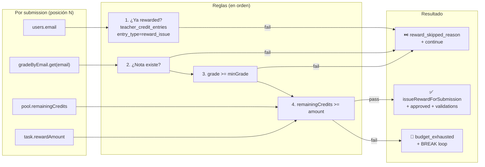
```mermaid
flowchart LR
    subgraph Input["Por submission (posición N)"]
        Email["users.email"]
        Grade["gradeByEmail.get(email)"]
        Pool["pool.remainingCredits"]
        Amount["task.rewardAmount"]
    end

    subgraph Rules["Reglas (en orden)"]
        R1["1. ¿Ya rewarded?\nteacher_credit_entries\nentry_type=reward_issue"]
        R2["2. ¿Nota existe?"]
        R3["3. grade >= minGrade"]
        R4["4. remainingCredits >= amount"]
    end

    subgraph Outcome["Resultado"]
        OK["✅ issueRewardForSubmission\n+ approved + validations"]
        SKIP["⏭️ reward_skipped_reason\n+ continue"]
        STOP["🛑 budget_exhausted\n+ BREAK loop"]
    end

    Email --> R1
    Grade --> R2 --> R3 --> R4
    Pool & Amount --> R4
    R1 -->|fail| SKIP
    R2 -->|fail| SKIP
    R3 -->|fail| SKIP
    R4 -->|fail| STOP
    R4 -->|pass| OK
```

### 10.4 Orquestación de emisión — `issueRewardForSubmission`

> 🟡 **Stakeholder Solana — Prioridad media** · Puente off-chain → on-chain

Punto central que conecta **presupuesto off-chain** con **liquidación on-chain** (o mock en piloto/demo).

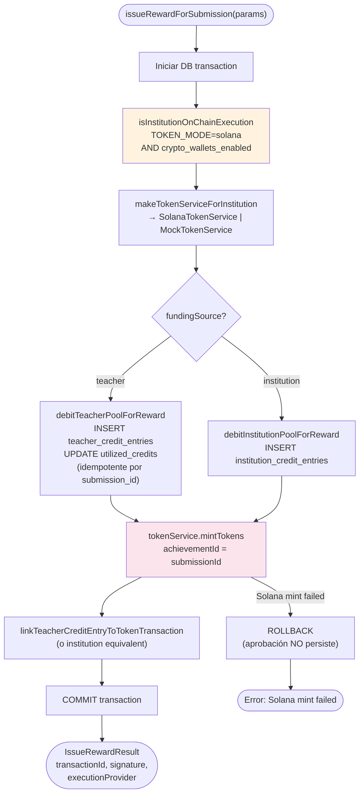
```mermaid
flowchart TD
    Start(["issueRewardForSubmission(params)"]) --> BeginTx["Iniciar DB transaction"]
    BeginTx --> CheckMode["isInstitutionOnChainExecution\nTOKEN_MODE=solana\nAND crypto_wallets_enabled"]
    CheckMode --> Factory["makeTokenServiceForInstitution\n→ SolanaTokenService | MockTokenService"]

    Factory --> FundSource{"fundingSource?"}
    FundSource -->|teacher| DebitTeacher["debitTeacherPoolForReward\nINSERT teacher_credit_entries\nUPDATE utilized_credits\n(idempotente por submission_id)"]
    FundSource -->|institution| DebitInst["debitInstitutionPoolForReward\nINSERT institution_credit_entries"]

    DebitTeacher --> Mint["tokenService.mintTokens\nachievementId = submissionId"]
    DebitInst --> Mint

    Mint --> Link["linkTeacherCreditEntryToTokenTransaction\n(o institution equivalent)"]
    Link --> Commit["COMMIT transaction"]
    Commit --> Return(["IssueRewardResult\ntransactionId, signature,\nexecutionProvider"])

    Mint -->|Solana mint failed| Rollback["ROLLBACK\n(aprobación NO persiste)"]
    Rollback --> Fail(["Error: Solana mint failed"])

    style CheckMode fill:#fff3e0
    style Mint fill:#fce4ec
```

### 10.5 Proceso on-chain — mint SPL a wallet custodial del estudiante

> 🟣 **Stakeholder Solana — Prioridad alta** · Slide 4 de 6 — prueba técnica SPL

Detalle de lo que ocurre dentro de `SolanaTokenService.mintTokens()` — **obligatorio en MVP** cuando `TOKEN_MODE=solana`.

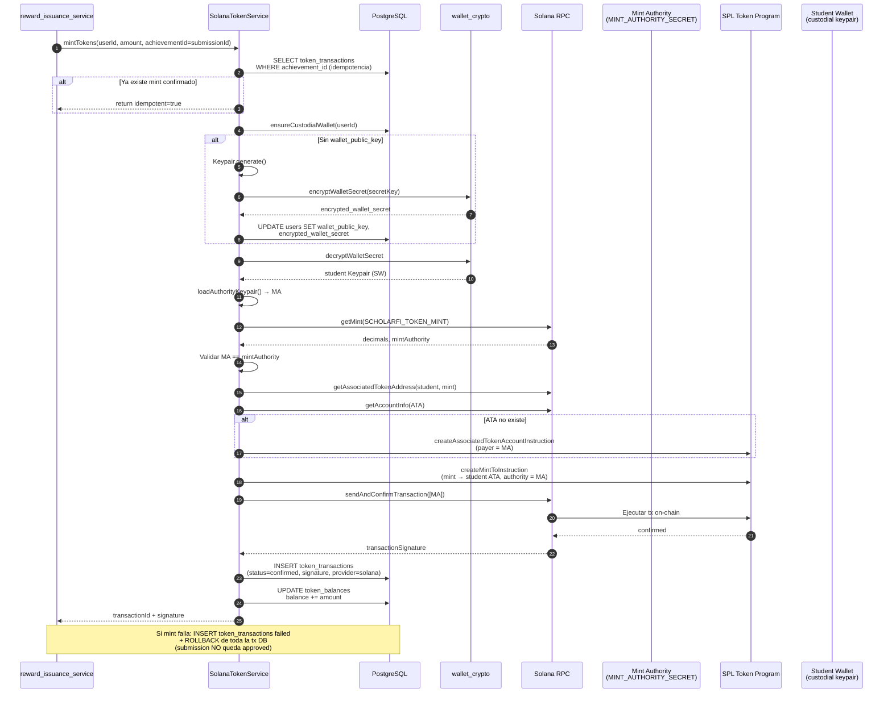
```mermaid
sequenceDiagram
    autonumber
    participant RS as reward_issuance_service
    participant STS as SolanaTokenService
    participant DB as PostgreSQL
    participant Crypto as wallet_crypto
    participant RPC as Solana RPC
    participant MA as Mint Authority<br/>(MINT_AUTHORITY_SECRET)
    participant SPL as SPL Token Program
    participant SW as Student Wallet<br/>(custodial keypair)

    RS->>STS: mintTokens(userId, amount, achievementId=submissionId)

    STS->>DB: SELECT token_transactions<br/>WHERE achievement_id (idempotencia)
    alt Ya existe mint confirmado
        STS-->>RS: return idempotent=true
    end

    STS->>DB: ensureCustodialWallet(userId)
    alt Sin wallet_public_key
        STS->>STS: Keypair.generate()
        STS->>Crypto: encryptWalletSecret(secretKey)
        Crypto-->>STS: encrypted_wallet_secret
        STS->>DB: UPDATE users SET wallet_public_key,<br/>encrypted_wallet_secret
    end

    STS->>Crypto: decryptWalletSecret
    Crypto-->>STS: student Keypair (SW)
    STS->>STS: loadAuthorityKeypair() → MA
    STS->>RPC: getMint(SCHOLARFI_TOKEN_MINT)
    RPC-->>STS: decimals, mintAuthority
    STS->>STS: Validar MA == mintAuthority

    STS->>RPC: getAssociatedTokenAddress(student, mint)
    STS->>RPC: getAccountInfo(ATA)

    alt ATA no existe
        STS->>SPL: createAssociatedTokenAccountInstruction<br/>(payer = MA)
    end
    STS->>SPL: createMintToInstruction<br/>(mint → student ATA, authority = MA)

    STS->>RPC: sendAndConfirmTransaction([MA])
    RPC->>SPL: Ejecutar tx on-chain
    SPL-->>RPC: confirmed
    RPC-->>STS: transactionSignature

    STS->>DB: INSERT token_transactions<br/>(status=confirmed, signature, provider=solana)
    STS->>DB: UPDATE token_balances<br/>balance += amount
    STS-->>RS: transactionId + signature

    Note over RS,DB: Si mint falla: INSERT token_transactions failed<br/>+ ROLLBACK de toda la tx DB<br/>(submission NO queda approved)
```

### 10.6 Diagrama de componentes on-chain (wallets y cuentas)

> 🟣 **Stakeholder Solana — Prioridad alta** · Slide 4 de 6 — cuentas y firmantes

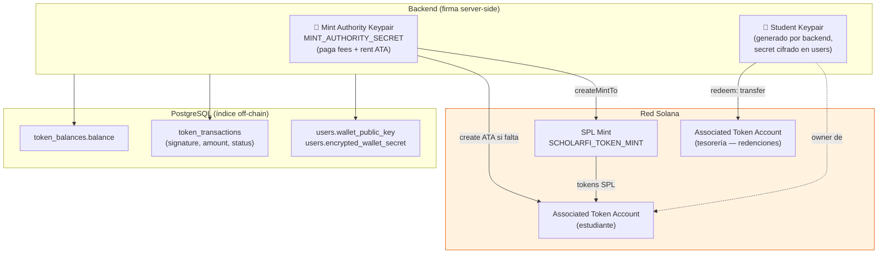
```mermaid
flowchart TB
    subgraph Backend["Backend (firma server-side)"]
        MA["🔑 Mint Authority Keypair\nMINT_AUTHORITY_SECRET\n(paga fees + rent ATA)"]
        SK["🔑 Student Keypair\n(generado por backend,\nsecret cifrado en users)"]
    end

    subgraph Solana["Red Solana"]
        Mint["SPL Mint\nSCHOLARFI_TOKEN_MINT"]
        ATA_S["Associated Token Account\n(estudiante)"]
        ATA_T["Associated Token Account\n(tesorería — redenciones)"]
    end

    subgraph DB["PostgreSQL (índice off-chain)"]
        U["users.wallet_public_key\nusers.encrypted_wallet_secret"]
        TT["token_transactions\n(signature, amount, status)"]
        TB["token_balances.balance"]
    end

    MA -->|"createMintTo"| Mint
    Mint -->|"tokens SPL"| ATA_S
    SK -.->|"owner de"| ATA_S
    MA -->|"create ATA si falta"| ATA_S

    SK -->|"redeem: transfer"| ATA_T

    Backend --> U
    Backend --> TT
    Backend --> TB

    style Solana fill:#fff3e0,stroke:#E65100
```

**Operaciones SPL en el MVP:**

| Operación | Instrucción | Firmantes | Cuándo |
|-----------|-------------|-----------|--------|
| Crear cuenta token estudiante | `createAssociatedTokenAccount` | Mint Authority | Primera recompensa del estudiante |
| Emitir recompensa | `mintTo` → ATA estudiante | Mint Authority | Cada aprobación / sync elegible |
| Redimir catálogo | `transfer` estudiante → tesorería | Mint Authority + Student | Canje aprobado por admin |

### 10.7 Secuencia end-to-end (Classroom → wallet estudiante)

> 🟣 **Stakeholder Solana — Prioridad alta — ⭐ SLIDE ESTRELLA** · Slide 3 de 6

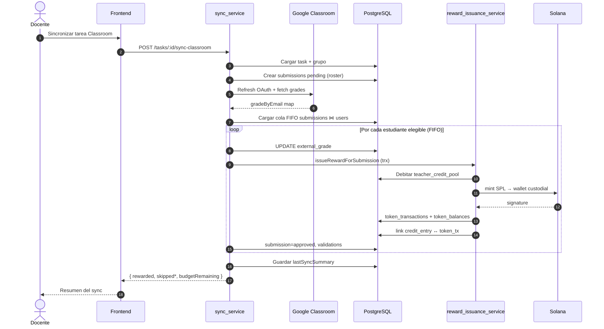
```mermaid
sequenceDiagram
    autonumber
    actor Doc as Docente
    participant FE as Frontend
    participant API as sync_service
    participant GC as Google Classroom
    participant DB as PostgreSQL
    participant RI as reward_issuance_service
    participant SOL as Solana

    Doc->>FE: Sincronizar tarea Classroom
    FE->>API: POST /tasks/:id/sync-classroom

    API->>DB: Cargar task + grupo
    API->>DB: Crear submissions pending (roster)
    API->>GC: Refresh OAuth + fetch grades
    GC-->>API: gradeByEmail map

    API->>DB: Cargar cola FIFO submissions ⋈ users

    loop Por cada estudiante elegible (FIFO)
        API->>DB: UPDATE external_grade
        API->>RI: issueRewardForSubmission (trx)
        RI->>DB: Debitar teacher_credit_pool
        RI->>SOL: mint SPL → wallet custodial
        SOL-->>RI: signature
        RI->>DB: token_transactions + token_balances
        RI->>DB: link credit_entry ↔ token_tx
        API->>DB: submission=approved, validations
    end

    API->>DB: Guardar lastSyncSummary
    API-->>FE: { rewarded, skipped*, budgetRemaining }
    FE-->>Doc: Resumen del sync
```

### 10.8 Tablas tocadas por operación (carga de datos)

> 🟡 **Stakeholder Solana — Prioridad media** · Alternativa a §10.1 para hablar de escala

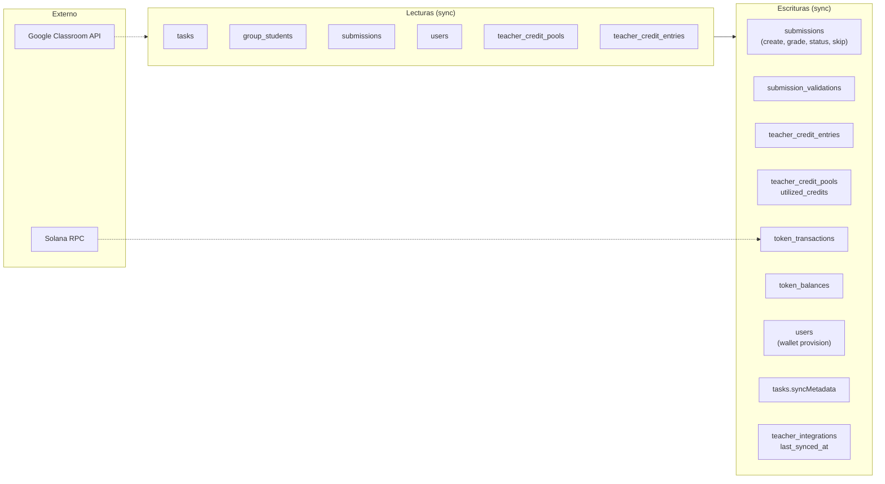
```mermaid
flowchart LR
    subgraph SyncRead["Lecturas (sync)"]
        R1["tasks"]
        R2["group_students"]
        R3["submissions"]
        R4["users"]
        R5["teacher_credit_pools"]
        R6["teacher_credit_entries"]
    end

    subgraph SyncWrite["Escrituras (sync)"]
        W1["submissions\n(create, grade, status, skip)"]
        W2["submission_validations"]
        W3["teacher_credit_entries"]
        W4["teacher_credit_pools\nutilized_credits"]
        W5["token_transactions"]
        W6["token_balances"]
        W7["users\n(wallet provision)"]
        W8["tasks.syncMetadata"]
        W9["teacher_integrations\nlast_synced_at"]
    end

    subgraph External["Externo"]
        E1["Google Classroom API"]
        E2["Solana RPC"]
    end

    SyncRead --> SyncWrite
    E1 -.-> SyncRead
    E2 -.-> W5
```

| Operación | Reads | Writes | Calls externos |
|-----------|-------|--------|----------------|
| Sync completo (N estudiantes) | 6+ tablas | 8+ tablas × N elegibles | 2–4 GC API + 0–N Solana tx |
| 1 recompensa on-chain | users, pools, token_tx | 5 tablas | 1–2 RPC (getMint, sendAndConfirm) |
| Idempotencia | token_transactions por achievement_id | 0 si ya existe | 0 |

> **Piloto/demo:** Con `TOKEN_MODE=mock`, la fase Solana se sustituye por escritura directa en `token_balances` / `token_transactions` sin RPC. El pipeline Classroom + FIFO + débito de pool **sigue igual**.

---

## 11. Arquitectura Post-MVP — Solana Programs

> 🟣 **Stakeholder Solana — Prioridad alta** · Roadmap técnico on-chain · Ideal como slide final o anexo

Visión de evolución después del MVP: pasar de **integración SPL directa** (backend firma `mintTo`) a **programas Anchor on-chain** que gobiernan presupuestos, emisión idempotente y redenciones con reglas verificables en la red.

### 11.1 MVP vs Post-MVP — qué cambia en Solana

| Aspecto | MVP (hoy) | Post-MVP (programs) |
|---------|-----------|---------------------|
| Liquidación | Backend llama `mintTo` vía `@solana/web3.js` | Programa Anchor hace CPI a SPL Token |
| Presupuesto | `teacher_credit_pools` en PostgreSQL | PDA **Reward Vault** on-chain + índice en DB |
| Idempotencia | `achievement_id` en `token_transactions` | PDA por `submission_hash` — no re-emite on-chain |
| Wallet estudiante | Custodial (backend genera keypair) | **Phantom / wallet-adapter** + migración opcional |
| Prueba de logro | Signature en DB + Solscan | **Achievement Record** account on-chain |
| Redención | Transfer custodial → tesorería | **Escrow program** con aprobación admin |
| Gobernanza workflow | 100% off-chain (RBAC) | Workflow off-chain; **reglas de emisión on-chain** |
| Verificabilidad | Solscan de mints | Solscan de instrucciones de programa + estado en cuentas |

### 11.2 Arquitectura Post-MVP (alto nivel)

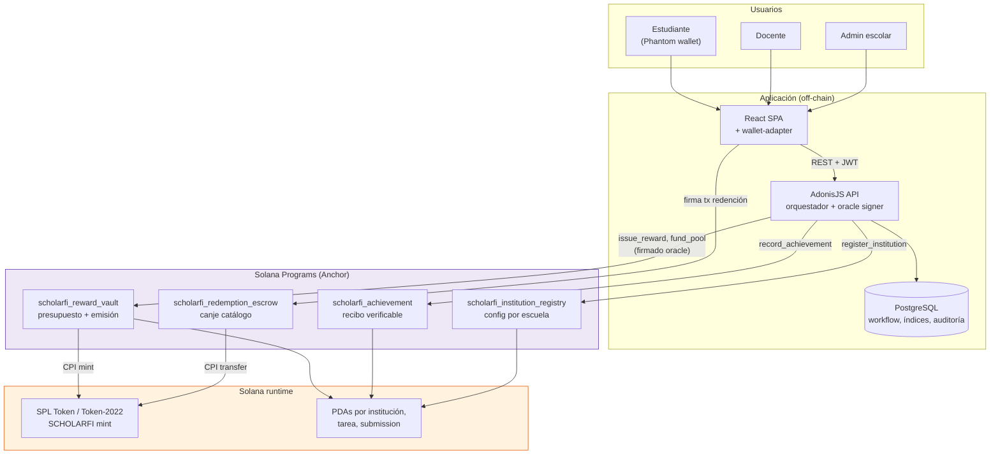
```mermaid
flowchart TB
    subgraph Users["Usuarios"]
        Student["Estudiante\n(Phantom wallet)"]
        Teacher["Docente"]
        Admin["Admin escolar"]
    end

    subgraph App["Aplicación (off-chain)"]
        FE["React SPA\n+ wallet-adapter"]
        API["AdonisJS API\norquestador + oracle signer"]
        DB[("PostgreSQL\nworkflow, índices, auditoría")]
    end

    subgraph Programs["Solana Programs (Anchor)"]
        REG["scholarfi_institution_registry\nconfig por escuela"]
        VAULT["scholarfi_reward_vault\npresupuesto + emisión"]
        ACH["scholarfi_achievement\nrecibo verificable"]
        RED["scholarfi_redemption_escrow\ncanje catálogo"]
    end

    subgraph Solana["Solana runtime"]
        SPL["SPL Token / Token-2022\nSCHOLARFI mint"]
        PDAs["PDAs por institución,\ntarea, submission"]
    end

    Student & Teacher & Admin --> FE
    FE -->|"REST + JWT"| API
    FE -->|"firma tx redención"| RED
    API --> DB
    API -->|"issue_reward, fund_pool\n(firmado oracle)"| VAULT
    API -->|"record_achievement"| ACH
    API -->|"register_institution"| REG

    VAULT -->|"CPI mint"| SPL
    VAULT --> PDAs
    ACH --> PDAs
    RED -->|"CPI transfer"| SPL
    REG --> PDAs

    style Programs fill:#ede7f6,stroke:#5E35B1
    style Solana fill:#fff3e0,stroke:#E65100
```

### 11.3 Suite de programas — ideas concretas

Cuatro programas pequeños y composables (mejor que un monolito):

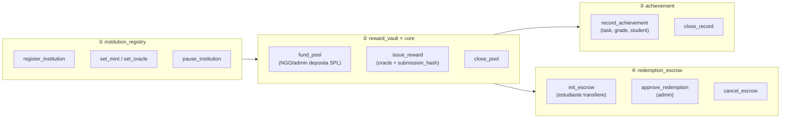
```mermaid
flowchart LR
    subgraph P1["① institution_registry"]
        R1["register_institution"]
        R2["set_mint / set_oracle"]
        R3["pause_institution"]
    end

    subgraph P2["② reward_vault ⭐ core"]
        V1["fund_pool\n(NGO/admin deposita SPL)"]
        V2["issue_reward\n(oracle + submission_hash)"]
        V3["close_pool"]
    end

    subgraph P3["③ achievement"]
        A1["record_achievement\n(task, grade, student)"]
        A2["close_record"]
    end

    subgraph P4["④ redemption_escrow"]
        E1["init_escrow\n(estudiante transfiere)"]
        E2["approve_redemption\n(admin)"]
        E3["cancel_escrow"]
    end

    P1 --> P2
    P2 --> P3
    P2 --> P4
```

#### Programa 1: `scholarfi_institution_registry`

Registro on-chain de cada escuela/institución.

| Instruction | Quién firma | Qué hace |
|-------------|-------------|----------|
| `register_institution` | Super-admin key | Crea PDA `[institution, code]` con mint SPL, oracle pubkey, estado activo |
| `update_oracle` | Institution admin | Rotar clave del backend autorizado a emitir |
| `pause` / `unpause` | Institution admin | Congelar emisiones sin tocar workflow off-chain |

**Cuenta (simplificada):**
```
InstitutionAccount {
  authority: Pubkey,
  oracle: Pubkey,        // backend signer
  token_mint: Pubkey,
  is_active: bool,
  bump: u8,
}
```

#### Programa 2: `scholarfi_reward_vault` ⭐ (más importante)

Vault SPL por institución/docente. Reemplaza la lógica crítica de `mintTo` directo.

| Instruction | Quién firma | Qué hace |
|-------------|-------------|----------|
| `fund_pool` | NGO / school admin | Transfiere SPL al vault PDA `[institution, teacher]` |
| `issue_reward` | Oracle (backend) + opcional admin | Valida: pool ≥ amount, submission_hash no usado, institución activa → **CPI `mint_to`** estudiante |
| `withdraw_unused` | Institution admin | Retira saldo no utilizado del vault |

**Idempotencia on-chain:** PDA `[submission_hash]` — si existe → instruction falla (no double-mint).

```
RewardVault {
  institution: Pubkey,
  teacher: Pubkey,
  token_mint: Pubkey,
  allocated: u64,
  distributed: u64,
  bump: u8,
}

IssuedReward (PDA por submission_hash) {
  student: Pubkey,
  amount: u64,
  task_id_hash: [u8; 32],
  issued_at: i64,
}
```

#### Programa 3: `scholarfi_achievement`

Recibo verificable de logro académico (complementa el mint, no lo reemplaza).

| Instruction | Quién firma | Qué hace |
|-------------|-------------|----------|
| `record_achievement` | Oracle | Escribe account con hash de tarea + nota + timestamp |
| *(fase 2)* `mint_credential` | Oracle | Metaplex cNFT como credencial portable del estudiante |

**Idea concreta fase 1:** account Anchor barato (~0.001 SOL rent) por logro.  
**Idea fase 2:** migrar a **compressed NFTs** (Metaplex Bubblegum) para escala masiva por aula.

#### Programa 4: `scholarfi_redemption_escrow`

Canje del catálogo de recompensas con trazabilidad on-chain.

| Instruction | Quién firma | Qué hace |
|-------------|-------------|----------|
| `init_escrow` | Estudiante (Phantom) | Transfiere SPL a escrow PDA vinculado a `redemption_id` |
| `approve_redemption` | School admin | Libera SPL a wallet del comercio/tesorería |
| `reject_escrow` | School admin | Devuelve SPL al estudiante |

### 11.4 Secuencia Post-MVP — emisión con programa

```mermaid
sequenceDiagram
    autonumber
    actor Doc as Docente
    participant API as Backend (oracle)
    participant DB as PostgreSQL
    participant VAULT as reward_vault program
    participant ACH as achievement program
    participant SPL as SPL Token
    participant SW as Student wallet

    Doc->>API: POST /tasks/:id/sync-classroom
    API->>DB: Pipeline FIFO (igual que MVP)

    loop Por cada estudiante elegible
        API->>API: submission_hash = hash(institution, task, student, submission)
        API->>VAULT: issue_reward(submission_hash, amount, student)
        VAULT->>VAULT: Validar vault balance + idempotencia PDA
        VAULT->>SPL: CPI mint_to(student ATA)
        SPL-->>SW: tokens acreditados
        VAULT-->>API: IssuedReward account creada

        API->>ACH: record_achievement(task, grade, student)
        ACH-->>API: Achievement account

        API->>DB: Índice off-chain (signature, accounts, submission_id)
    end
```

### 11.5 Modelo de cuentas on-chain (PDAs)

```mermaid
flowchart TB
    subgraph Seeds["PDAs derivadas (ejemplos)"]
        I["[b\"institution\", code]\n→ InstitutionAccount"]
        V["[b\"vault\", institution, teacher]\n→ RewardVault + token account"]
        S["[b\"issued\", submission_hash]\n→ IssuedReward (idempotencia)"]
        A["[b\"achievement\", submission_hash]\n→ AchievementRecord"]
        E["[b\"escrow\", redemption_id]\n→ RedemptionEscrow"]
    end

    subgraph Signers["Firmantes"]
        Oracle["Oracle keypair\n(backend HSM)"]
        Student["Estudiante\n(Phantom)"]
        Admin["Admin PDA authority"]
    end

    Oracle --> V
    Oracle --> S
    Oracle --> A
    Student --> E
    Admin --> E
```

### 11.6 Evolución por fases (roadmap Solana)

```mermaid
timeline
    title Evolución on-chain ScholarFi
    section MVP
        SPL mint directo : Custodial wallets
                        : Solscan proof
                        : PostgreSQL pools
    section Post-MVP v1
        reward_vault program : Presupuesto on-chain
                             : Idempotencia por submission_hash
                             : Oracle signer backend
    section Post-MVP v2
        achievement + escrow : Achievement accounts
                             : Redención con Phantom
                             : Migración custodial → self-custody
    section Post-MVP v3
        Escala : Compressed NFTs (credenciales)
               : Token-2022 transfer hooks
               : Multi-region RPC + priority fees
```

### 11.7 Qué gana el ecosistema Solana (mensaje para stakeholders)

| Hoy (MVP) | Post-MVP con programs |
|-----------|----------------------|
| N mints SPL verificables por sync | + vault accounts con estado consultable on-chain |
| Actividad en Solscan | + instrucciones de programa indexables (Dune / Solana FM) |
| 1 escuela = N txs por semestre | + PDAs persistentes = **datos on-chain** por institución |
| Custodial → barrera de entrada baja | + Phantom = **usuarios reales** con wallet propia |
| Backend como único firmante | + oracle model extensible a **multisig escolar** |

**Métricas on-chain que pueden medir:**
- `issue_reward` instructions / mes
- SPL volume minted por `SCHOLARFI_TOKEN_MINT`
- Active `RewardVault` PDAs (escuelas financiadas)
- Student wallets con balance > 0
- Redemptions completadas on-chain

### 11.8 Stack técnico Post-MVP (referencia)

| Capa | Tecnología propuesta |
|------|---------------------|
| Programs | **Anchor** (Rust) |
| Client backend | `@coral-xyz/anchor` + `@solana/web3.js` |
| Client frontend | `@solana/wallet-adapter-react` (Phantom, Solflare) |
| Token | SPL Token → evaluar **Token-2022** (transfer hooks para compliance) |
| Credenciales | Metaplex **cNFT** (fase 2) |
| Indexación | Helius / Triton webhooks → actualizar PostgreSQL |
| Deploy | devnet piloto → mainnet-beta tras auditoría |

---

## 12. Cómo editar estos diagramas

1. **En VS Code / Cursor:** instala extensión "Markdown Preview Mermaid Support" o usa preview nativo.
2. **En GitHub:** los bloques ` ```mermaid ` se renderizan automáticamente en `.md`.
3. **En Miro / Lucidchart:** exporta desde [mermaid.live](https://mermaid.live) pegando el código.
4. **En Notion:** bloque `/code` → lenguaje Mermaid.

---

## Referencias en el código

| Tema | Ubicación |
|------|-----------|
| Frontend API client | `scholarfi/src/api/client.ts` |
| Rutas y roles UI | `scholarfi/src/App.tsx` |
| Enlaces Solscan | `scholarfi/src/utils/solanaExplorer.ts` |
| Rutas API | `scholarfi-back/start/routes.ts` |
| Token factory | `scholarfi-back/app/services/tokens/factory.ts` |
| Emisión de recompensas | `scholarfi-back/app/services/credits/reward_issuance_service.ts` |
| Google Classroom sync | `scholarfi-back/app/services/integrations/google_classroom/sync_service.ts` |
| Roster → submissions | `scholarfi-back/app/services/integrations/google_classroom/roster_submission_service.ts` |
| Grades GC API | `scholarfi-back/app/services/integrations/google_classroom/client.ts` |
| Mint SPL on-chain | `scholarfi-back/app/services/tokens/solana_token_service.ts` |
| ADR completo | `scholarfi/_bmad-output/planning-artifacts/architecture.md` |
