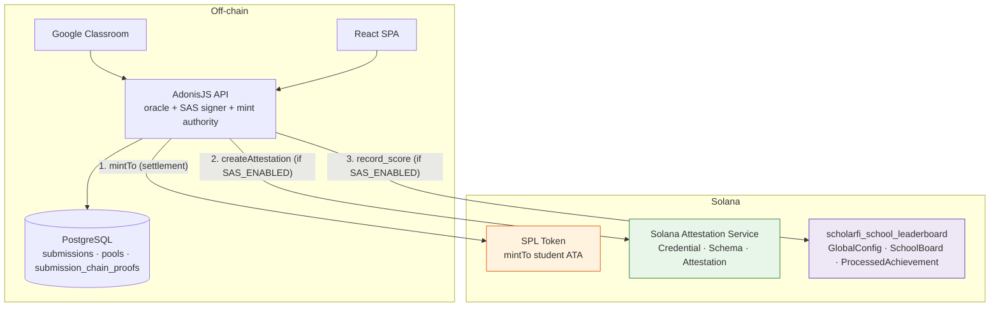
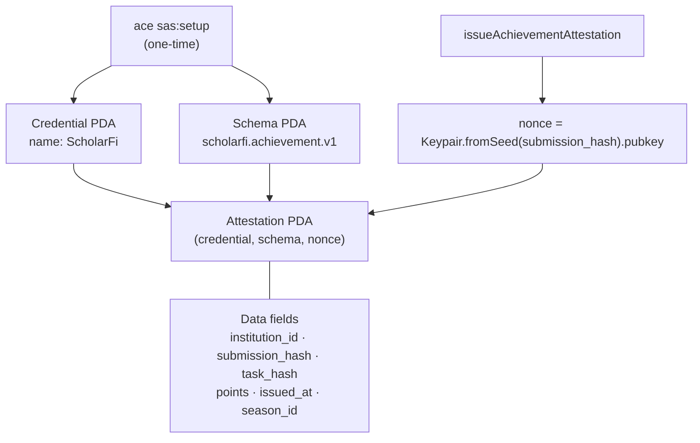
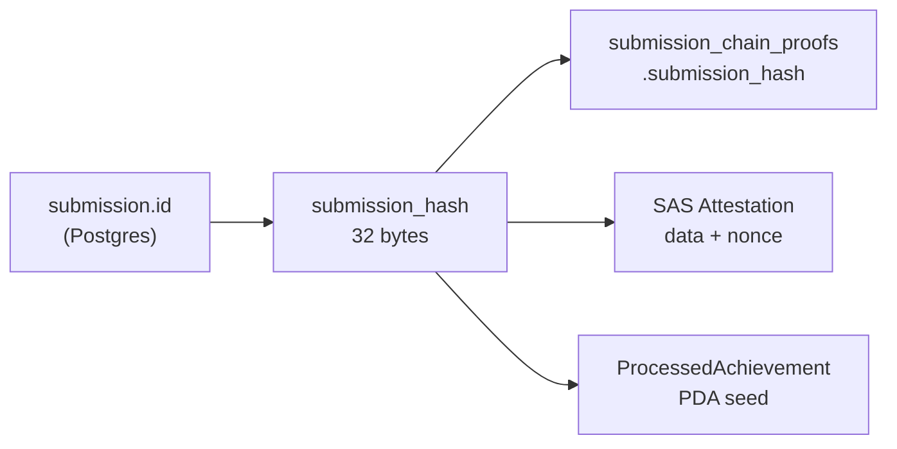
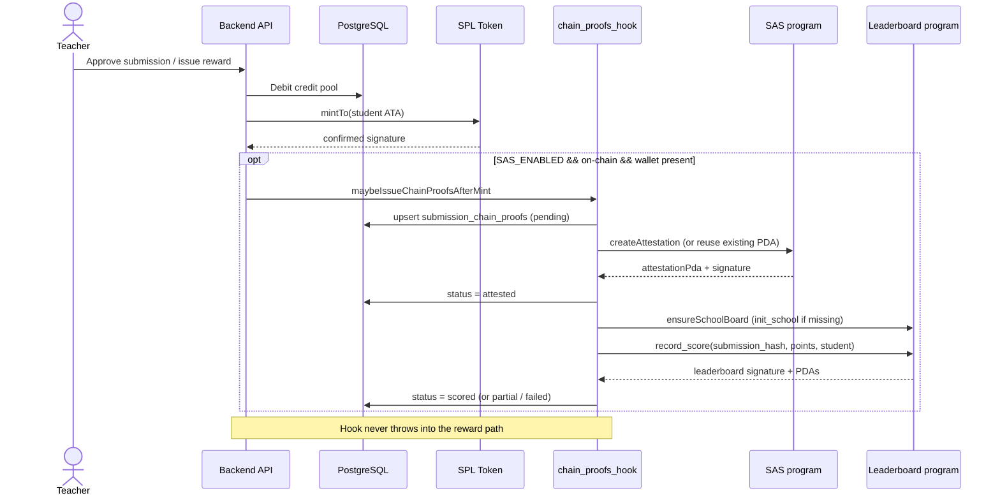
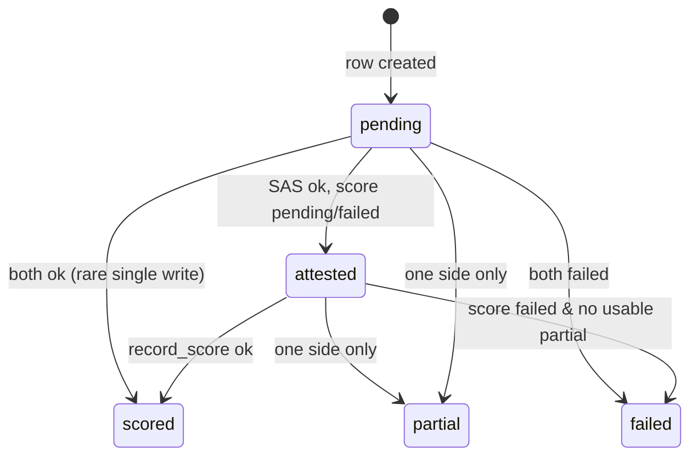
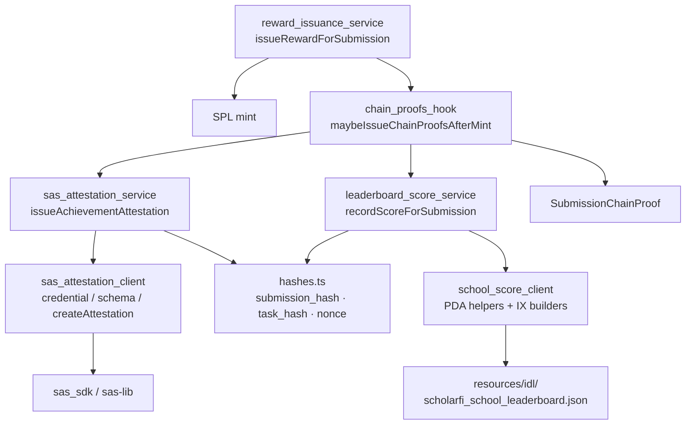
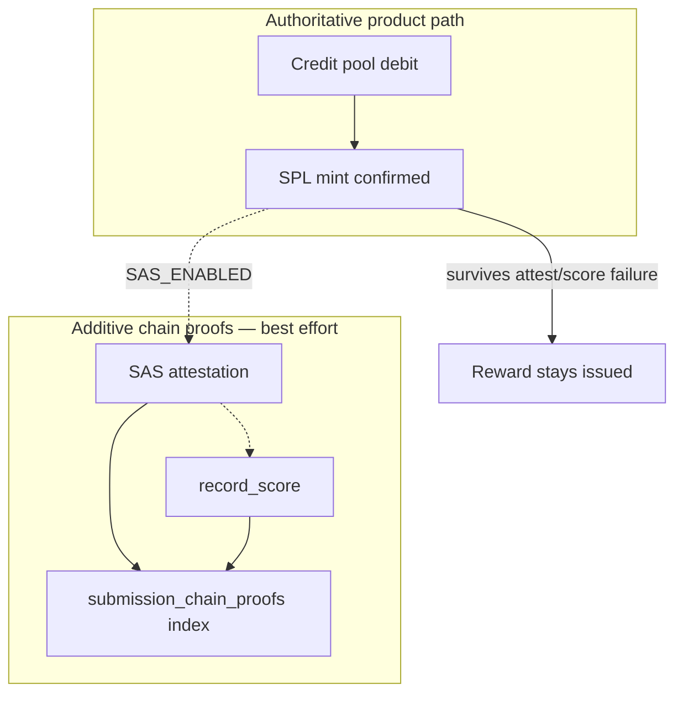

# Architecture — PDA program + SAS attestation (as-built)

Current architecture of the on-chain school leaderboard PDAs and the off-chain SAS attestation path already wired into reward issuance.

**Status:** implemented (devnet POC)  
**Program id:** `9H5oUgPiu6AZKP6BTwSZ2z7gQSCg3d1Gxmk6q3ZSK9yF`  
**Related specs:** [`sas-school-leaderboard.md`](./sas-school-leaderboard.md) (original proposal), [`sas-school-leaderboard-accounts.md`](./sas-school-leaderboard-accounts.md) (account fields)

> **Order vs proposal:** production flow is **mint → attest → record_score** (best-effort), not attest → score → mint. Credits/SPL remain authoritative; SAS + leaderboard are additive proofs.

---

## 1. Layer map



| Layer | Responsibility | Trust model |
|-------|----------------|-------------|
| **SPL** | Economic settlement of rewards | Existing custodial mint authority |
| **SAS** | Portable, verifiable achievement claim | Credential authority = ScholarFi signer |
| **Leaderboard program** | Aggregate school points + idempotency PDAs | Oracle signer gates `init_school` / `record_score` |
| **Postgres** | Workflow, credit pools, chain-proof index | App DB (source of truth for product state) |

---

## 2. PDA program — accounts & instructions

```mermaid
flowchart LR
    subgraph Program["scholarfi_school_leaderboard"]
        GC["GlobalConfig\nseeds: [b\"config\"]"]
        SB["SchoolBoard\nseeds: [b\"school\", institution_id LE]"]
        PA["ProcessedAchievement\nseeds: [b\"processed\", submission_hash]"]
    end

    IX1["initialize\n(authority)"] --> GC
    IX2["init_school\n(oracle)"] --> SB
    IX2 -.-> GC
    IX3["record_score\n(oracle)"] --> SB
    IX3 --> PA
    IX3 -.-> GC
    IX4["set_paused\n(authority)"] --> GC
```

### PDAs (implemented)

| Account | Seeds | Purpose |
|---------|-------|---------|
| `GlobalConfig` | `[b"config"]` | Singleton: authority, oracle, `season_id`, `paused` |
| `SchoolBoard` | `[b"school", institution_id.to_le_bytes()]` | Aggregate school score for ranking |
| `ProcessedAchievement` | `[b"processed", submission_hash]` | Idempotency: one submission → one score credit |

### Instructions (implemented)

| Instruction | Signer | Effect |
|-------------|--------|--------|
| `initialize` | authority + payer | Creates `GlobalConfig` (season=1, paused=false) |
| `init_school(institution_id, name_hash)` | oracle + payer | Creates `SchoolBoard`; fails if paused |
| `record_score(submission_hash, points, student)` | oracle + payer | `SchoolBoard` += points; creates `ProcessedAchievement` |
| `set_paused(paused)` | authority | Emergency stop |

`record_score` guards: not paused · `0 < points ≤ u16::MAX` · school season matches global season · `ProcessedAchievement` must not already exist.

### Not on-chain yet

`StudentScore` PDA · `rotate_season` · `set_oracle` · on-chain SAS account check on `record_score` (proposal v1.1).

---

## 3. SAS surface (ecosystem program)



**Schema layout bytes:** `[3, 13, 13, 3, 8, 3]` → U64, VecU8, VecU8, U64, I64, U64.

Student wallet is **not** stored in SAS data; it is only passed to `record_score` / `ProcessedAchievement.student`.

---

## 4. Canonical hash bridge

Same `submission_hash` links off-chain rows, SAS attestation, and the leaderboard idempotency PDA:

```text
submission_hash = SHA256("scholarfi:submission:{submissionId}")   // 32 bytes
task_hash       = SHA256("scholarfi:task:{taskId}")
nonce pubkey    = Keypair.fromSeed(submission_hash).publicKey
```



---

## 5. End-to-end runtime flow

Triggered after a successful reward mint (`issueRewardForSubmission`), when `SAS_ENABLED=true`, institution is on-chain, mint is `confirmed`, and the student wallet is known.



### Status machine (`submission_chain_proofs`)



Statuses used in code: `pending` → `attested` → `scored` / `partial` / `failed`.

---

## 6. Backend service map



### Ops commands

| Command | Role |
|---------|------|
| `node ace sas:setup` | Create/pin Credential + Schema PDAs |
| `node ace sas:attest` | Manual attestation (+ optional `--record-score`) |
| `node ace school-score:devnet` | Smoke initialize / init_school / record_score |

---

## 7. Trust & failure boundaries



- Mint success is **independent** of attestation / leaderboard failures.
- Oracle / SAS authorized signer often reuse the mint authority keypair in the POC.
- No on-chain gate yet: `record_score` does not verify a SAS attestation account (planned v1.1).

---

## 8. Source map

| Area | Path |
|------|------|
| Program | `scholarfi-contracts/programs/scholarfi-school-leaderboard/` |
| Hashes | `scholarfi-back/app/services/attestation/hashes.ts` |
| SAS client / service | `scholarfi-back/app/services/attestation/sas_*.ts` |
| Post-mint hook | `scholarfi-back/app/services/attestation/chain_proofs_hook.ts` |
| Leaderboard client | `scholarfi-back/app/services/leaderboard/` |
| Reward integration | `scholarfi-back/app/services/credits/reward_issuance_service.ts` |
| Proof model / migration | `submission_chain_proof.ts` · `1776000000000_create_submission_chain_proofs.ts` |

---

## 9. Implemented vs still proposed

| Item | Status |
|------|--------|
| GlobalConfig / SchoolBoard / ProcessedAchievement | Done |
| initialize / init_school / record_score / set_paused | Done |
| SAS credential + schema + attestation | Done |
| Post-mint hook + `submission_chain_proofs` | Done |
| StudentScore PDA | Not yet |
| rotate_season / set_oracle | Not yet |
| On-chain SAS check on `record_score` | Not yet (v1.1) |
| Leaderboard UI / public indexer API | Not yet |
