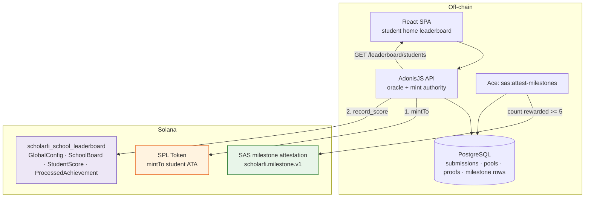
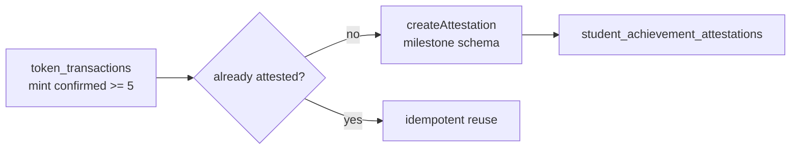

# Architecture — PDA program + SAS attestation (as-built)

Current architecture of the on-chain school leaderboard PDAs, student scores, and off-sync milestone SAS attestation.

**Status:** implemented (devnet POC)  
**Program id:** `9H5oUgPiu6AZKP6BTwSZ2z7gQSCg3d1Gxmk6q3ZSK9yF`  
**Related specs:** [`sas-school-leaderboard.md`](./sas-school-leaderboard.md), [`sas-school-leaderboard-accounts.md`](./sas-school-leaderboard-accounts.md)

> **Runtime order:** **mint → `record_score`** (best-effort, on reward path).  
> **SAS milestones** (e.g. “Logro completado: 5 primeras actividades”) run **off** the sync/reward path via `node ace sas:attest-milestones`.

---

## 1. Layer map



| Layer | Responsibility |
|-------|----------------|
| **SPL** | Economic settlement |
| **Leaderboard program** | School + student aggregates + idempotency |
| **SAS milestones** | Portable “5 primeras actividades” claim (off-sync) |
| **Postgres API** | MVP outstanding-student ranking (reads mint ledger) |

---

## 2. PDA program — accounts & instructions

```mermaid
flowchart LR
    subgraph Program["scholarfi_school_leaderboard"]
        GC["GlobalConfig\n[b\"config\"]"]
        SB["SchoolBoard\n[b\"school\", institution_id]"]
        SS["StudentScore\n[b\"student\", school, wallet]"]
        PA["ProcessedAchievement\n[b\"processed\", submission_hash]"]
    end

    IX3["record_score"] --> SB
    IX3 --> SS
    IX3 --> PA
```

| Account | Seeds | Purpose |
|---------|-------|---------|
| `GlobalConfig` | `[b"config"]` | authority, oracle, season, paused |
| `SchoolBoard` | `[b"school", institution_id LE]` | School aggregate |
| `StudentScore` | `[b"student", school_board, student]` | Outstanding-student aggregate |
| `ProcessedAchievement` | `[b"processed", submission_hash]` | One submission → one score |

`record_score` still creates `ProcessedAchievement`, updates `SchoolBoard`, and `init_if_needed` updates `StudentScore`.

---

## 3. Reward path (sync-friendly)

```mermaid
sequenceDiagram
    participant Sync as Classroom sync / approve
    participant API as issueRewardForSubmission
    participant SPL as SPL mint
    participant Hook as maybeRecordLeaderboardAfterMint
    participant LB as Leaderboard program

    Sync->>API: issue reward
    API->>SPL: mintTo
    SPL-->>API: confirmed
    API->>Hook: score-only (no SAS)
    Hook->>LB: record_score
    Note over Hook: Best-effort; never fails the reward
```

SAS is **not** called here.

---

## 4. Milestone attestation (off-sync)

**MVP rule:** first time a student has **≥ 5** confirmed rewarded mints → one SAS attestation.

| Piece | Detail |
|-------|--------|
| Key | `first_5_activities` |
| Title (demo/UI) | `Logro completado: 5 primeras actividades` |
| Hash | `SHA256("scholarfi:achievement:first_5_activities:{studentId}")` |
| Schema | `scholarfi.milestone.v1` |
| Table | `student_achievement_attestations` |
| Command | `node ace sas:attest-milestones` |



---

## 5. Student home leaderboard

- **API:** `GET /api/v1/leaderboard/students` (institution-scoped)
- **UI:** “Estudiantes destacados” on [`StudentHome`](../src/pages/student/StudentHome.tsx) between Actividad and Marketplace
- **Read path:** Postgres sum of confirmed mint amounts (fast MVP); on-chain `StudentScore` remains the verifiable write path

---

## 6. Source map

| Area | Path |
|------|------|
| Program | `scholarfi-contracts/programs/scholarfi-school-leaderboard/` |
| Score-only hook | `scholarfi-back/app/services/attestation/chain_proofs_hook.ts` |
| Milestone service | `scholarfi-back/app/services/attestation/milestone_attestation_service.ts` |
| Leaderboard client | `scholarfi-back/app/services/leaderboard/` |
| Leaderboard API | `scholarfi-back/app/controllers/leaderboard_controller.ts` |
| Student home | `scholarfi/src/pages/student/StudentHome.tsx` |

---

## 7. Implemented checklist

| Item | Status |
|------|--------|
| GlobalConfig / SchoolBoard / ProcessedAchievement | Done |
| StudentScore on `record_score` | Done |
| Score-only post-mint hook | Done |
| Milestone SAS off-sync (`first_5_activities`) | Done |
| Student home outstanding board | Done |
| Per-submission SAS on reward path | Removed |
| Extra milestones (10, 25) | Not yet |
| On-chain SAS gate on `record_score` | Not yet |
