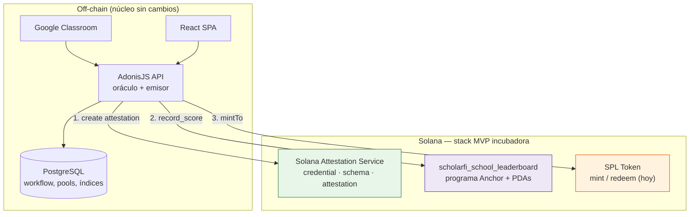
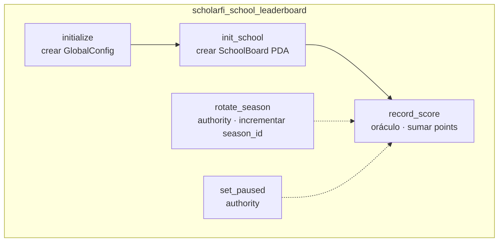
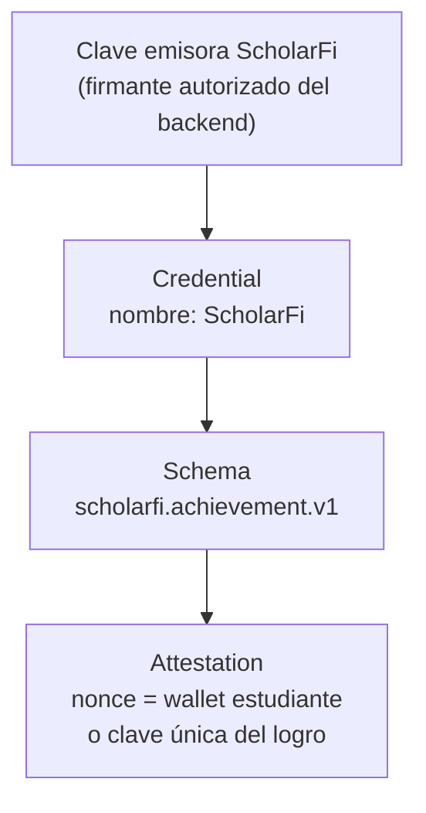
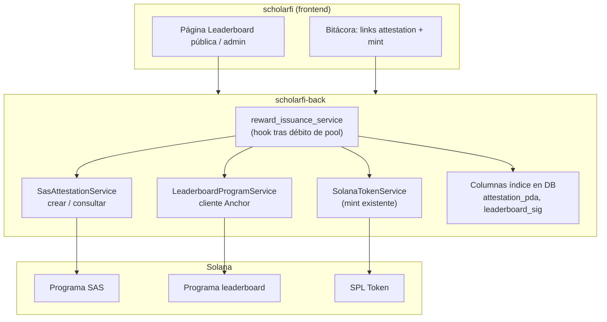
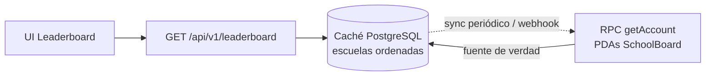
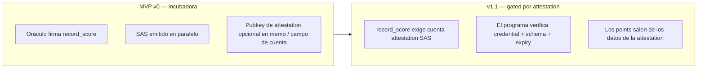
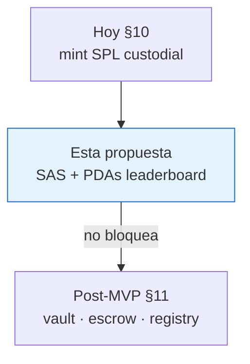
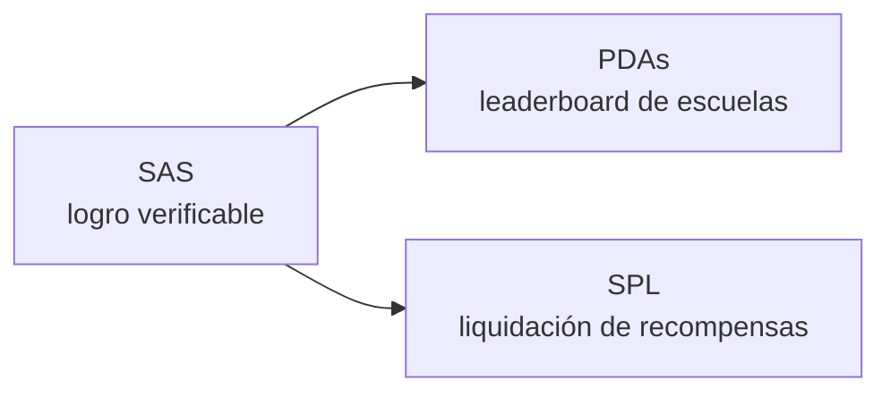

# Propuesta — SAS + Leaderboard descentralizado de escuelas

Propuesta de arquitectura para la fase MVP del incubadora de Solana: combinar **Solana Attestation Service (SAS)** para logros académicos verificables con un **programa Anchor propio + PDAs** para un leaderboard descentralizado de escuelas, manteniendo el camino actual de **mint SPL** para la liquidación de recompensas.

**Estado:** propuesta (no implementada)  
**Complementa:** `docs/arquitectura-mvp.md` §10 (SPL hoy) y §11 (vault/escrow post-MVP — diferido)  
**No reemplaza:** pools de crédito, workflow de Classroom ni mint custodial en PostgreSQL/backend

---

## 1. Problema y oportunidad

| Pedido del incubadora | ScholarFi hoy | Esta propuesta |
|-----------------------|---------------|----------------|
| Más productos de Solana | Solo mint/transfer SPL | **SAS** + **programa propio** + SPL |
| Programas Solana con PDAs | Ninguno | `scholarfi_school_leaderboard` |
| Esfuerzo académico verificable | Signature en DB + Solscan | Attestation SAS en wallet del estudiante |
| Superficie social / competitiva | Ninguna | Ranking on-chain por escuela |

---

## 2. Mapa de capas — qué vive dónde



| Capa | Responsabilidad | Modelo de confianza |
|------|-----------------|---------------------|
| **SAS** | Prueba portable de logro aprobado | Autoridad del credential = emisor ScholarFi |
| **Programa leaderboard** | Agrega puntos de escuela (y opcionalmente estudiante) en PDAs | Firmante oráculo (mismo backend); en v1.1 puede exigir cuenta SAS |
| **SPL** | Liquidación económica de recompensas | Mint authority = camino custodial existente |

---

## 3. Arquitectura de alto nivel

```mermaid
flowchart TB
    subgraph Actors["Actores"]
        Student["Estudiante\nwallet custodial"]
        Teacher["Docente"]
        Admin["Admin escolar"]
        Public["Público / demo\nleaderboard"]
    end

    subgraph App["Aplicación ScholarFi"]
        FE["Frontend"]
        API["Backend oráculo\n+ firmante autorizado SAS"]
        DB[("PostgreSQL")]
    end

    subgraph SASDomain["SAS (programa del ecosistema)"]
        Cred["Credential PDA\nemisor ScholarFi"]
        Schema["Schema PDA\nscholarfi.achievement.v1"]
        Att["Attestation PDA\npor logro del estudiante"]
    end

    subgraph LBDomain["Programa leaderboard (nuestro)"]
        Config["GlobalConfig PDA\n[b\"config\"]"]
        School["SchoolBoard PDA\n[b\"school\", institution_id]"]
        StudentScore["StudentScore PDA\nopcional\n[b\"student\", school, wallet]"]
    end

    subgraph Token["Liquidación"]
        Mint["Mint SCHOLARFI"]
        ATA["ATA del estudiante"]
    end

    Teacher & Admin -->|"aprobar envío"| FE
    Student --> FE
    Public -->|"leer escuelas rankeadas"| FE
    FE --> API
    API --> DB

    API -->|"emitir attestation"| Att
    Cred --> Schema --> Att

    API -->|"record_score"| School
    Config -.-> School
    School -.-> StudentScore

    API -->|"mintTokens"| Mint
    Mint --> ATA

    style Cred fill:#e8f5e9,stroke:#2E7D32
    style Schema fill:#e8f5e9,stroke:#2E7D32
    style Att fill:#e8f5e9,stroke:#2E7D32
    style Config fill:#ede7f6,stroke:#5E35B1
    style School fill:#ede7f6,stroke:#5E35B1
    style StudentScore fill:#ede7f6,stroke:#5E35B1
    style Mint fill:#fff3e0,stroke:#E65100
    style ATA fill:#fff3e0,stroke:#E65100
```

---

## 4. Secuencia end-to-end — aprobar → attest → score → mint

```mermaid
sequenceDiagram
    autonumber
    participant T as Docente / Admin
    participant API as Backend (oráculo)
    participant DB as PostgreSQL
    participant SAS as Solana Attestation Service
    participant LB as Programa leaderboard
    participant SPL as SPL Token
    participant W as Wallet estudiante

    T->>API: Aprobar envío / recompensa
    API->>DB: Debitar pool de créditos (existente)
    API->>DB: Persistir aprobación (límite de tx)

    API->>SAS: Crear attestation<br/>(schema, wallet estudiante, task hash, points)
    SAS-->>API: Attestation PDA + signature

    API->>LB: record_score(escuela, points, season,<br/>ref attestation opcional)
    LB->>LB: Actualizar SchoolBoard PDA<br/>(+ StudentScore PDA opcional)
    LB-->>API: Signature de la tx del programa

    API->>SPL: mintTo(ATA estudiante, amount)
    SPL-->>W: Tokens acreditados
    SPL-->>API: Signature del mint

    API->>DB: Indexar attestation PDA,<br/>tx leaderboard, tx mint

    Note over API,W: Orden: attest → score → mint.<br/>Si falla el mint, rollback de aprobación como hoy;<br/>documentar compensación SAS/LB en notas operativas.
```

---

## 5. Layout de PDAs — programa leaderboard

```mermaid
flowchart LR
    subgraph Seeds["Seeds de PDA"]
        C["GlobalConfig\nseeds: [b\"config\"]"]
        S["SchoolBoard\nseeds: [b\"school\", institution_id_bytes]"]
        U["StudentScore opcional\nseeds: [b\"student\", school_pda, wallet]"]
    end

    C -->|"authority, season_id, paused"| Runtime["Estado del programa"]
    S -->|"total_points, achievement_count,\nlast_updated, season_id"| Runtime
    U -->|"points, contribution_count"| Runtime
```

### 5.1 Campos de cuentas (MVP)

**`GlobalConfig`**
| Campo | Tipo | Notas |
|-------|------|--------|
| `authority` | `Pubkey` | Puede rotar oráculo / pausar |
| `oracle` | `Pubkey` | Firmante del backend para `record_score` |
| `season_id` | `u64` | Permite reinicios sin redeploy del programa |
| `paused` | `bool` | Parada de emergencia |
| `bump` | `u8` | |

**`SchoolBoard`**
| Campo | Tipo | Notas |
|-------|------|--------|
| `institution_id` | `u64` o `[u8; 32]` | Id / hash de la escuela off-chain |
| `name_hash` | `[u8; 32]` | Binding opcional del nombre para display |
| `total_points` | `u64` | Métrica principal de ranking |
| `achievement_count` | `u64` | Métrica secundaria |
| `season_id` | `u64` | Debe coincidir con la season del config |
| `last_updated` | `i64` | Timestamp Unix |
| `bump` | `u8` | |

**`StudentScore` (fase opcional)**
| Campo | Tipo | Notas |
|-------|------|--------|
| `school` | `Pubkey` | SchoolBoard padre |
| `student` | `Pubkey` | Wallet custodial o self-custody |
| `points` | `u64` | Sin PII on-chain |
| `contribution_count` | `u64` | |
| `bump` | `u8` | |

### 5.2 Instrucciones (MVP)



| Instrucción | Firmante | Efecto |
|-------------|----------|--------|
| `initialize` | Authority de deploy | Crea `GlobalConfig` |
| `init_school` | Oráculo o authority | Crea `SchoolBoard` para la institución |
| `record_score` | Oráculo | Incrementa points de escuela (+ estudiante opcional) en la season actual |
| `rotate_season` | Authority | Incrementa `season_id`; los boards pueden resetearse en el próximo write o con ix explícita |
| `set_paused` | Authority | Bloquea `record_score` |

---

## 6. Modelo de credential SAS



### 6.1 Campos sugeridos del schema (`scholarfi.achievement.v1`)

| Campo | Propósito |
|-------|-----------|
| `institution_id` | Vínculo con la escuela |
| `submission_hash` | Enlace idempotente al envío off-chain |
| `task_hash` | Identidad de la tarea sin PII |
| `points` | Puntos aportados al leaderboard |
| `issued_at` | Timestamp |
| `season_id` | Alineación con la season del leaderboard |

Los datos sensibles (nombre del estudiante, email, texto de calificación) permanecen en PostgreSQL — no van en el payload de la attestation más allá de hashes/ids necesarios para verificación.

---

## 7. Diagrama de componentes — dónde cae el código



---

## 8. Flujo de datos — lectura del leaderboard en UI



Las PDAs on-chain son la **fuente de verdad**. PostgreSQL guarda un índice ordenado para UI rápida (mismo patrón que el indexado de signatures de mint hoy). No rankear solo por balances de tokens — las redenciones distorsionarían el ranking.

---

## 9. Confianza y evolución



| Fase | Enforcement on-chain | Fuerza del demo |
|------|----------------------|-----------------|
| **MVP v0** | PDAs gated por oráculo + pruebas SAS | Alta — tres superficies Solana |
| **v1.1** | Scoring gated por SAS | Mayor — el programa verifica un producto del ecosistema |
| **Después** | Vault / escrow §11 | Reglas económicas on-chain (propuesta aparte) |

---

## 10. Corte de alcance

### Incluido en esta propuesta
- Credential SAS + schema `scholarfi.achievement.v1`  
- Anchor `scholarfi_school_leaderboard` con PDAs `GlobalConfig` + `SchoolBoard`  
- Hook en el pipeline existente aprobación → mint  
- UI de leaderboard pública/admin respaldada por PDAs indexadas  
- Links a explorer para attestation + tx del programa + mint  

### Fuera (diferir)
- Verificación completa de SAS dentro del programa (v1.1)  
- PII del estudiante o texto de calificación on-chain  
- Vault / institution registry / redemption escrow (§11)  
- Migración a Phantom / self-custody  
- Fórmulas de ranking complejas (Elo, decay)  

---

## 11. Relación con la arquitectura existente



| Documento | Rol |
|-----------|-----|
| `docs/arquitectura-mvp.md` §10 | Camino Solana de producción actual (mantener) |
| **Este archivo** | SAS + leaderboard con PDAs orientado al incubadora |
| `docs/arquitectura-mvp.md` §11 | Programas económicos posteriores (vault/escrow) |

`scholarfi_achievement` en §11 queda en gran medida **reemplazado para credenciales** por SAS; conservar achievement de §11 solo si aún se quiere una cuenta recibo custom además de SAS (por lo general innecesario).

---

## 12. Resumen para pitch (un slide)



> ScholarFi usa **SAS** para credenciales académicas portables, un **programa propio con PDAs** para el ranking descentralizado de escuelas, y **SPL Token** para liquidar recompensas — sin mover aún los presupuestos escolares on-chain.
